# Expert Decision Replay Platform (EDRP)

A centralized platform for recording, reviewing, and auditing organizational decisions — built during the **Infosys Springboard Virtual Internship**.

EDRP lets an organization capture a decision (the problem, the alternatives considered, the discussion around it), route it through a role-based, multi-level approval workflow, and keep a permanent, versioned, audited record of what was decided and why — with an AI assistant layered on top to summarize, answer questions about, and help route decisions, always with a human making the final call.

---

## Table of Contents

- [Problem Statement](#problem-statement)
- [Key Objectives](#key-objectives)
- [Core Features](#core-features)
- [AI Capabilities](#ai-capabilities)
- [Technical Architecture](#technical-architecture)
- [Roles & Permissions](#roles--permissions)
- [Decision Approval Workflow](#decision-approval-workflow)
- [Notifications & Email](#notifications--email)
- [AI Architecture & Fail-Soft Behavior](#ai-architecture--fail-soft-behavior)
- [Rate Limiting](#rate-limiting)
- [Security Considerations](#security-considerations)
- [Database Overview](#database-overview)
- [API Overview](#api-overview)
- [Screenshots](#screenshots)
- [Docker Deployment](#docker-deployment)
- [Local Development Setup](#local-development-setup)
- [Environment Variables](#environment-variables)
- [Testing & Verification](#testing--verification)
- [Project Structure](#project-structure)
- [Future Improvements / Known Limitations](#future-improvements--known-limitations)

---

## Problem Statement

Organizational decisions are often made in scattered conversations, chat threads, or meetings — with no consistent record of *what* was decided, *why*, *who* approved it, or *what alternatives were considered*. When a similar decision comes up later, there is no easy way to find precedent. Reviewers and managers have no structured way to see a decision's full context before approving it, and there is no audit trail for compliance or retrospective review.

EDRP addresses this by giving every decision a permanent, structured lifecycle: problem statement, alternatives, discussion, versioned edits, a defined multi-level approval chain, and a full audit log — with AI assistance to reduce the effort of summarizing, searching, and routing that workflow.

## Key Objectives

- Give every organizational decision a single, structured, permanent record.
- Enforce a consistent, role-based, multi-level approval workflow instead of ad hoc sign-off.
- Preserve full history: every material edit is versioned, every workflow action is audit-logged.
- Route review work automatically where possible (team-manager auto-assignment) without removing human judgment from any approval/rejection.
- Reduce manual effort with AI assistance (summarization, similar-decision lookup, natural-language querying, drafting help, routing suggestions) — while keeping every AI output either read-only/advisory or gated behind an explicit human confirmation.
- Run identically in a one-command local Docker stack or against a hosted Postgres/Redis for day-to-day development.

---

## Core Features

### Decision Creation and Lifecycle
Any authenticated user can create a decision (title, problem statement, category). A decision moves through five statuses — **Draft → Under Review → Approved / Rejected → Archived** — derived automatically from its approval chain (see [Decision Approval Workflow](#decision-approval-workflow)). Only the decision's creator or an Administrator may edit or delete it.

### Alternatives
Each decision can carry multiple **alternatives** — title, description, pros/cons, cost estimate, feasibility score, risk assessment — for side-by-side comparison, with one alternative markable as "selected."

### Discussion / Comments
Threaded comments per decision (one reply level deep), optionally scoped to a specific alternative, plus a distinct **meeting note** entry type for formal minutes. Comments are closed once a decision reaches a terminal status (Approved/Rejected).

### Multi-Level Approval Workflow
A Manager or Administrator assigns reviewers at numbered levels (1, 2, 3…). Level 1 must be a user with the **Reviewer** role; level 2 and above are open more broadly (used for the team-manager auto-assignment below). Reviews are sequential — a level can't be decided until every lower level is Approved. See [Decision Approval Workflow](#decision-approval-workflow) for the full mechanics.

### Team-Based Approval Routing
Teams have one manager. When an **Employee**-role user's decision receives its level-1 reviewer assignment, the platform automatically assigns that employee's team manager as the level-2 reviewer (if the team and manager exist, and the manager isn't the creator) — no manual step required.

### Notifications
In-app notifications are created for: a new review assignment, a recorded approval decision, an escalation, and a decision status change. Each user can list, mark read (individually or all-at-once), and delete their own notifications.

### Email Alerts
The same events that trigger an in-app notification also queue a background email via Gmail SMTP, when SMTP is configured. Email is strictly best-effort — a failed or unconfigured SMTP setup never blocks the underlying workflow action, it's just logged and skipped.

### Decision History / Versioning
A snapshot (`DecisionVersion`) is captured automatically whenever a decision's derived status changes, giving a versioned trail of the decision's lifecycle over time, viewable per-decision.

### Audit Logging
Every significant backend action (approval decisions, auto-assignments, AI-initiated task routing, etc.) writes an `AuditLog` row — actor, action, entity type/ID, and structured metadata — queryable by actor, by entity, or individually.

### Reports and Analytics
Manager/Administrator-only reporting area: summary, decision, approval, team, and audit reports, each also exportable as **PDF** and **Excel**. The dashboard itself shows decision status breakdowns and recent decisions to every user, with an additional organization-wide panel (total/active users, users by role, total alternatives) for Administrators.

### User and Team Management
Administrators manage user accounts (create, update, deactivate, role changes). Managers and Administrators manage teams (create, update, delete, add/remove members). Every user can view their own profile and change their own password; a "My Team" view shows a Manager their own team.

### Role-Based Access Control
Every protected route is gated by an authenticated user's role, enforced via a reusable `require_role(...)` dependency at the router level, plus finer-grained ownership checks (e.g. "edit your own comment, or be an Administrator") in the service layer. See the [Roles & Permissions](#roles--permissions) matrix below.

---

## AI Capabilities

All AI features are built on the same primary→fallback provider pattern (see [AI Architecture & Fail-Soft Behavior](#ai-architecture--fail-soft-behavior)) and degrade to a safe, deterministic behavior — never an error page — if no provider is configured or reachable.

| Capability | What it does | Role restriction |
|---|---|---|
| **Decision Summarization** | Rewrites a decision's existing facts (problem statement, alternatives, approval progress, comment/revision counts) into a concise executive summary. | Any authenticated user |
| **Similar Decisions** | Picks up to 3 other decisions in the same category most similar to the current one. | Any authenticated user |
| **Ask About This Decision** | Free-text Q&A grounded only in that decision's own data (title, status, problem statement, discussion, approval history) — answers "I don't know" rather than guessing. | Any authenticated user |
| **NL-to-Data Querying** | Free-text questions about aggregate decision/approval data ("how many decisions are approved?"). Classified into a small **fixed, whitelisted set of intents**, each mapped 1:1 to an existing, already-reviewed repository method. **No SQL is ever generated or executed from user input or model output** — if the classifier can't confidently match a known intent, it returns a deterministic keyword-based match or a help message, never a raw query. | Any authenticated user |
| **Approval Intelligence** | Read-only `approve` / `reject` / `needs_review` recommendation with reasoning, built from the decision's real alternatives, discussion, and approval history. The prompt explicitly frames the output as advisory only — it never approves, rejects, or otherwise mutates anything. | Reviewer, Manager, Administrator |
| **AI Problem-Statement Generation** | Drafts a problem statement from a title, for the user to review/edit before saving — never auto-saves or creates a decision on its own. | Any authenticated user |
| **AI Task Routing** | Natural-language commands ("reassign decision `<id>` to reviewer `<name>`", "escalate decision `<id>`") interpreted into one of exactly two supported structured actions, validated against real reviewer-role/eligibility/decision-state rules, and executed through the **same existing approval service** the manual UI uses — never a bespoke mutation path. **Requires explicit user confirmation** before anything is changed; the interpret step never mutates anything by itself. | Manager, Administrator |
| **Persistent AI Conversations** | A general-purpose AI chat assistant with conversation history owned entirely by the server (not the client) — conversations and messages are stored per-user and reloaded from the database, never reconstructed from a client-supplied history array. | Any authenticated user (strictly own conversations only) |
| **Gemini → Groq Fallback** | Every AI feature above tries Gemini first; if Gemini is unconfigured, rate-limited, or fails, it automatically retries via Groq before falling back to deterministic behavior. | — |

---

## Technical Architecture

**Backend**
- **FastAPI** (async) — HTTP layer, thin routers over a service layer
- **SQLAlchemy 2.0** (async ORM) + **asyncpg** — all database access is async, no blocking DB calls in the request path
- **PostgreSQL** — UUID primary keys throughout
- **Alembic** — schema migrations
- **Redis** (optional) — distributed rate limiting, with automatic in-memory fallback
- **Google Gemini** (primary) / **Groq** (fallback) — LLM providers behind a single abstraction (`llm_client.py`)
- **Gmail SMTP** (optional) — outbound email alerts
- **JWT** (access + refresh tokens) — authentication
- **Passlib/bcrypt** — password hashing

**Frontend**
- **React 19** + **Vite** — SPA
- **React Router** — client-side routing
- **Axios** — API client
- **Recharts** — dashboard/report charts
- **lucide-react** — icons

**Deployment**
- **Docker Compose** — Postgres, Redis, backend, frontend (nginx-served static build), each with a healthcheck
- Also runs entirely without Docker: `uvicorn` locally against a hosted Postgres (e.g. Neon) and `vite dev` for the frontend

---

## Roles & Permissions

Four fixed roles, backed by a `roles` lookup table: **Employee, Reviewer, Manager, Administrator**.

| Area | Employee | Reviewer | Manager | Administrator |
|---|:---:|:---:|:---:|:---:|
| Create decisions, alternatives, comments | ✅ | ✅ | ✅ | ✅ |
| Edit/delete **own** decisions, alternatives, comments | ✅ | ✅ | ✅ | ✅ |
| Edit/delete **any** decision, alternative, comment | ❌ | ❌ | ❌ | ✅ |
| Change decision status directly | ❌ | ❌ | ✅ | ✅ |
| Assign a reviewer to a decision | ❌ | ❌ | ✅ | ✅ |
| Record an approval decision (approve/reject/escalate) | only if the assigned reviewer | ✅ (if assigned) | ✅ (if assigned) | ✅ (any) |
| Reset an approval back to Pending | ❌ | ❌ | ✅ | ✅ |
| View own AI conversations, summaries, similar decisions, Ask-this-decision, NL query, problem-statement drafting | ✅ | ✅ | ✅ | ✅ |
| Approval Intelligence (AI recommendation) | ❌ | ✅ | ✅ | ✅ |
| AI Task Routing | ❌ | ❌ | ✅ | ✅ |
| View/manage teams | view only | view only | create/update/manage members | full control incl. delete |
| View "My Team" | — | — | ✅ (own team) | — |
| User management (create/update/deactivate/change role) | ❌ | ❌ | ❌ | ✅ |
| List all users | ❌ | ❌ | ✅ | ✅ |
| Reports & analytics (view + export) | ❌ | ❌ | ✅ | ✅ |
| Audit log (read) | own actions visible via general list | same | same | same — audit log endpoints require authentication but are not further role-restricted |
| Notifications (own) | ✅ | ✅ | ✅ | ✅ |
| Dashboard | role-aware summary | role-aware summary | role-aware summary | + organization-wide stats panel |

Ownership rules (edit/delete your own vs. an Administrator override) are enforced in the service layer, not just the router — e.g. a Reviewer can delete their own comment, but not someone else's, even though both hit the same `DELETE /comments/{id}` route.

---

## Decision Approval Workflow

1. A decision starts in **Draft**.
2. A Manager/Administrator assigns a reviewer at **level 1** — that reviewer must hold the **Reviewer** role. This creates an `Approval` row (`status = pending`).
3. **Team-manager auto-assignment**: if the decision's creator is an **Employee**, belongs to a team, that team has a manager, and the manager isn't the creator themselves, the platform automatically creates a **level 2** approval assigned to that manager — no manual action needed. (If any of those conditions don't hold, level 2 simply isn't auto-assigned; a Manager/Administrator can still assign one by hand.)
4. Reviews are recorded **sequentially**: level *N* can't be decided until every level below it is `approved`. The assigned reviewer for a level (or any Administrator) records `approved`, `rejected`, or `escalated`.
5. The decision's overall **status is derived, not set directly**, from its approvals: any `rejected` approval → decision `Rejected`; every approval `approved` → decision `Approved`; anything else → `Under Review`. Each status change snapshots a `DecisionVersion`.
6. **Escalation** notifies the decision's team manager if one exists, otherwise every active Administrator.
7. A Manager/Administrator can **reset** an approval back to `pending` (e.g. to redo a review), which re-derives the decision's status.
8. A decision that reaches **Approved** or **Rejected** is terminal — no further approval actions are accepted on it.
9. AI Task Routing (see above) can trigger the same reassignment/escalation actions from a natural-language command, but only after explicit user confirmation, and only through this exact same service logic — no separate mutation path.

---

## Notifications & Email

- **In-app**: every reviewer assignment, approval decision, escalation, and decision status change creates a `Notification` row for the relevant user(s), visible via the notifications list/unread-count/mark-read endpoints.
- **Email**: the same events additionally queue a background email (Gmail SMTP) when `SMTP_HOST`/`SMTP_FROM_EMAIL` are configured. Comments also trigger an email to the decision's creator (skipped if they authored the comment themselves).
- **Fail-soft by design**: notification creation and email sending are both wrapped so a failure never rolls back or blocks the workflow action that triggered them — only the notification/email itself is affected, and it's logged.

---

## AI Architecture & Fail-Soft Behavior

Every AI feature is built on one shared function, `llm_client.generate_text_with_provider()`:

1. Try **Gemini** (`GOOGLE_API_KEY`). Any failure mode — unconfigured, non-200 response, timeout, network error, empty/malformed payload — is caught and treated as "try the next provider," never raised to the caller.
2. If Gemini didn't produce a usable answer, try **Groq** (`GROQ_API_KEY`) the same way.
3. If neither is configured or both fail, the function returns `(None, None)` — every caller is written to treat that as "AI unavailable" and fall back to its own deterministic behavior (a template-based summary, a keyword-based NL classifier, a clear "temporarily unavailable" message) rather than surfacing an error.

Nothing in this pipeline ever executes LLM-generated SQL, never persists a fabricated response when both providers fail, and API keys are read only from environment configuration — never logged, never returned in any response body.

---

## Rate Limiting

`RateLimitMiddleware` applies a fixed request budget (`RATE_LIMIT_REQUESTS` per `RATE_LIMIT_WINDOW_SECONDS`, defaults 60/60s) to every request, with two backends:

- **Redis-backed** (when `REDIS_URL` is configured and reachable): an atomic Lua sliding-window script against a Redis sorted set — correct across multiple backend processes/replicas.
- **In-memory fallback** (always available): a per-process counter, used automatically whenever `REDIS_URL` is unset, or whenever a Redis call fails for any reason at request time. A Redis outage degrades rate limiting to per-process instead of disabling it — verified live: stopping the Redis container mid-session did not interrupt request handling.

**Keying**: authenticated requests are rate-limited per **user ID** (decoded from the JWT); unauthenticated requests fall back to **client IP**. This was confirmed directly against a running instance — Redis held both `ratelimit:user:<uuid>` and `ratelimit:ip:<address>` keys simultaneously, depending on whether the request carried a valid token.

---

## Security Considerations

- **JWT authentication** — short-lived access tokens plus refresh tokens; refresh tokens are individually revocable (`POST /auth/logout`).
- **RBAC** enforced at the router level (`require_role(...)`) for role-uniform routes, and in the service layer for ownership-based rules (edit your own vs. Administrator override).
- **Protected routes** — every non-auth, non-health endpoint requires a valid bearer token; FastAPI's dependency system rejects unauthenticated requests before any handler code runs.
- **No secrets committed** — `backend/.env` is gitignored; only `backend/.env.example` (placeholder values only) is tracked. `docker-compose.yml` contains no real credentials — Docker-local Postgres/Redis use fixed, documented, non-secret local development defaults, and everything else comes from the gitignored `.env` via `env_file`.
- **AI Task Routing requires explicit confirmation** — the interpret step (parsing a natural-language command) never mutates anything; only a second, explicit confirm call (echoing back exactly what was previewed) can trigger a real reassignment or escalation, and that confirm step re-validates everything against current data rather than trusting the client.
- **AI recommendations are advisory only** — Approval Intelligence returns a recommendation and reasoning; it has no code path that approves, rejects, or otherwise changes a decision's state. A human reviewer/manager/administrator always makes the actual call through the normal approval endpoints.
- **AI conversation privacy** — a user can only read, message, or delete their own conversations; a Manager/Administrator gets the same "not found" response as anyone else when reaching for someone else's conversation (a deliberate choice over a 403, to avoid confirming that a given conversation ID belongs to someone else).
- **No raw SQL from user or model input anywhere** — NL-to-data querying uses a fixed, whitelisted intent set mapped to existing repository methods; AI Task Routing's structured output is validated by Pydantic against a fixed action enum before it can reach the mutation layer.

---

## Database Overview

UUID primary keys throughout; PostgreSQL native enums for fixed vocabularies (decision/approval status, notification type). Key tables:

| Table | Purpose |
|---|---|
| `roles` | The four fixed roles (lookup table, not a hardcoded enum column). |
| `users` | Accounts — credentials, role, optional team membership. |
| `refresh_tokens` | Individually revocable JWT refresh tokens. |
| `teams` | Groups of users with one manager. |
| `decisions` | The core entity — title, problem statement, category, derived status, version counter, creator, optional team. |
| `alternatives` | Options considered for a decision (cost, risk, feasibility, selected flag). |
| `comments` | Threaded discussion / meeting notes per decision (optionally per alternative). |
| `approvals` | One row per (decision, level, reviewer) — the full approval audit trail; status transitions rather than being overwritten. |
| `decision_versions` | Snapshots captured on every derived status change. |
| `attachments` | Uploaded files linked to exactly one of decision/alternative/comment (enforced by a CHECK constraint); the DB stores only the file path, never the binary. |
| `notifications` | In-app alerts per recipient. |
| `audit_logs` | Actor, action, entity type/ID, and metadata for every significant backend action. |
| `ai_conversations` | A user's persisted AI chat threads. |
| `ai_messages` | Individual turns within a conversation — `role` is constrained at the database level to exactly `user`/`assistant` (no `system` value exists in the schema at all). |

---

## API Overview

All routes are prefixed `/api/v1`. Interactive docs: `/api/v1/docs` (Swagger) when the backend is running.

| Area | Prefix | Notes |
|---|---|---|
| Health | `/health` | Liveness + DB-readiness probe (used by Docker healthcheck). |
| Authentication | `/auth` | `register`, `login`, `refresh`, `logout`. |
| Users | `/users` | Self-service (`/me`, `/me/password`) + Manager/Administrator listing + Administrator-only create/update/deactivate/role-change. |
| Teams | `/teams` | List/view for everyone; create/update/member management for Manager/Administrator; delete for Administrator. |
| Decisions | `/decisions` | CRUD, status update, versions, plus the decision-scoped AI endpoints: `summary`, `similar`, `ask`, `ai-recommendation`. |
| Alternatives | `/alternatives` | CRUD + "select this alternative." |
| Approvals | `/approvals` | Assignment, review decision, reset. |
| Comments | `/comments` | CRUD, decision-scoped listing. |
| Attachments | `/attachments` | Upload/download/list, scoped to decision, alternative, or comment. |
| Notifications | `/notifications` | List, unread/unread-count, mark read (single/all), delete. |
| Audit Logs | `/audit-logs` | List, by actor, by entity, by ID. |
| Dashboard | `/dashboard` | Role-aware summary. |
| Reports | `/reports` | Manager/Administrator only — summary/decision/approval/team/audit, each as JSON, PDF, or Excel. |
| NL Query | `/nl-query` | Whitelisted-intent natural-language querying over decision/approval aggregates. |
| AI | `/ai` | `generate-problem-statement`, `task` (routing), `conversations` (+ `/messages`) — see [AI Capabilities](#ai-capabilities). |

---

## Screenshots

> Image files are included in this repository under `docs/screenshots/`

### Login
Sign-in screen — JWT-based authentication entry point.


### Dashboard
Role-aware landing view: decision status breakdown, recent decisions, and (for Administrators) an organization-wide stats panel.

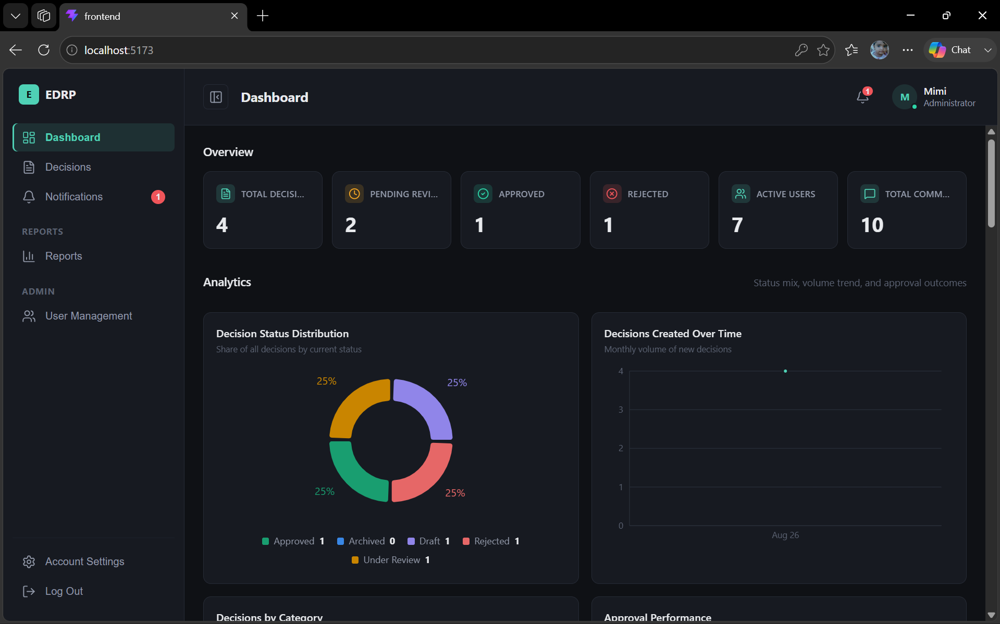

### Create Decision
The decision-creation form — title, category, and problem statement.

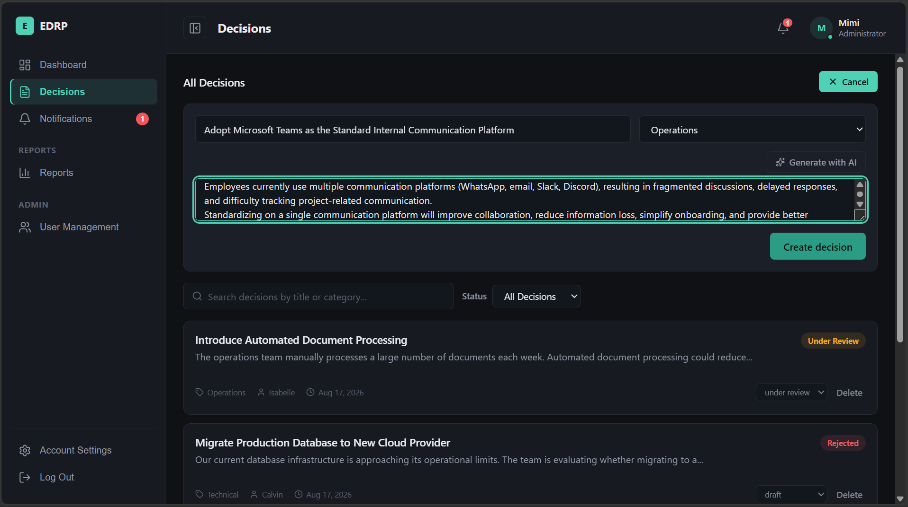

### AI Problem Statement Generation
"Generate with AI" drafting a problem statement from a title for the user to review before saving.

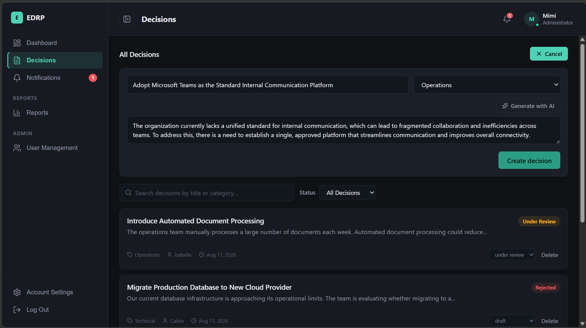

### Decision Details
The full decision record view — header, metadata, status, and tabbed sections for the rest of the workflow.

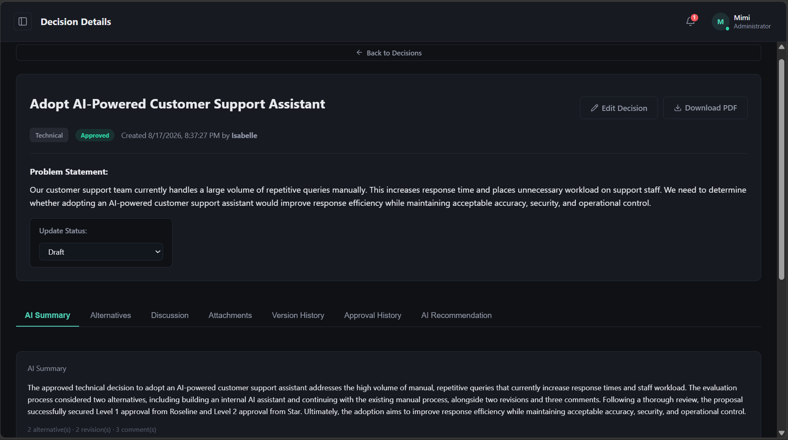

### Alternatives & Discussion
Side-by-side alternative comparison alongside the threaded comment/meeting-note discussion.

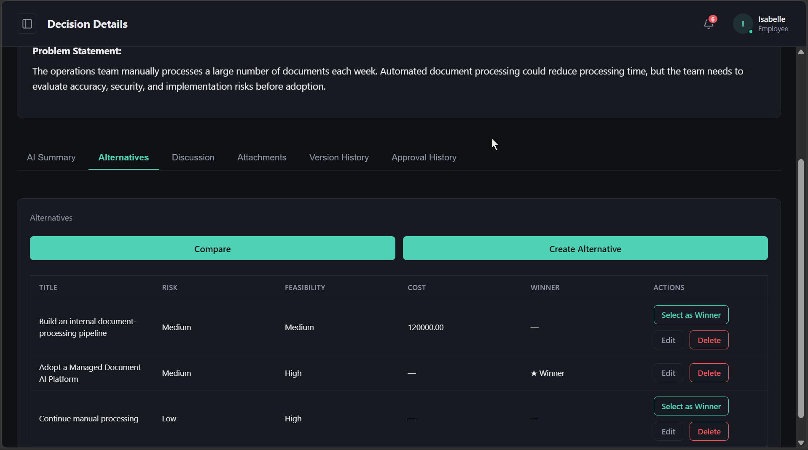

### Approval Workflow
Multi-level approval history for a decision — assigned reviewers, per-level status, and actions available to the current user.

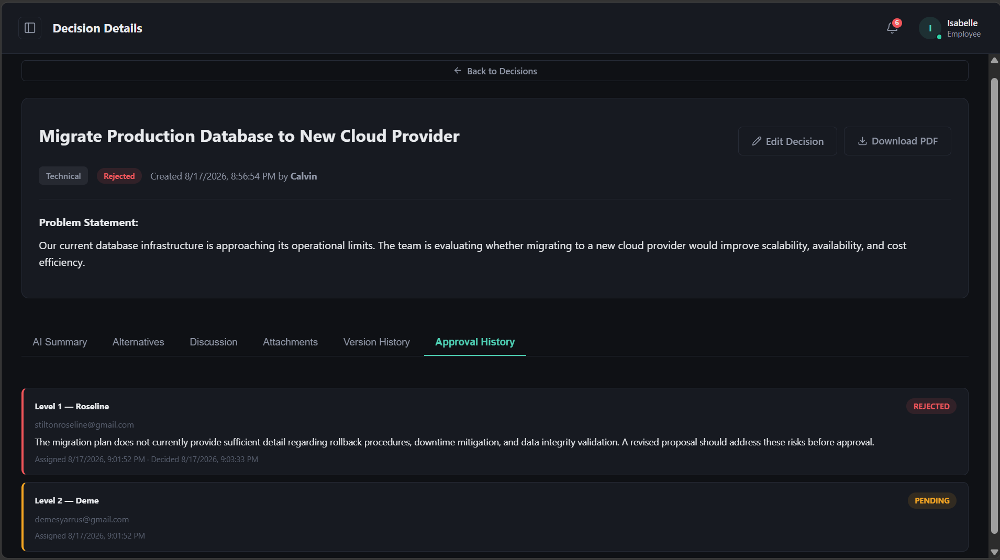

### Notifications
The in-app notification list — assignments, decisions, escalations, and status changes.

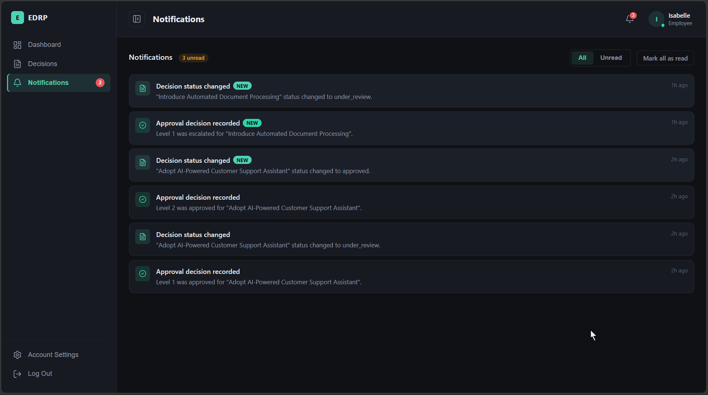

### Email Notification
An example email alert delivered via Gmail SMTP for an approval or comment event.

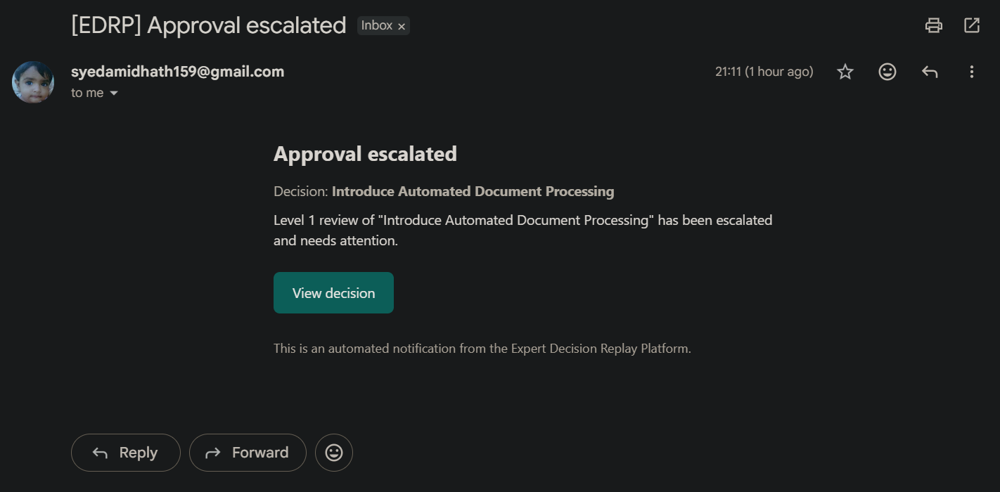

### AI Summary
The AI-generated decision summary tab, with its "generated by Gemini / deterministic" attribution.

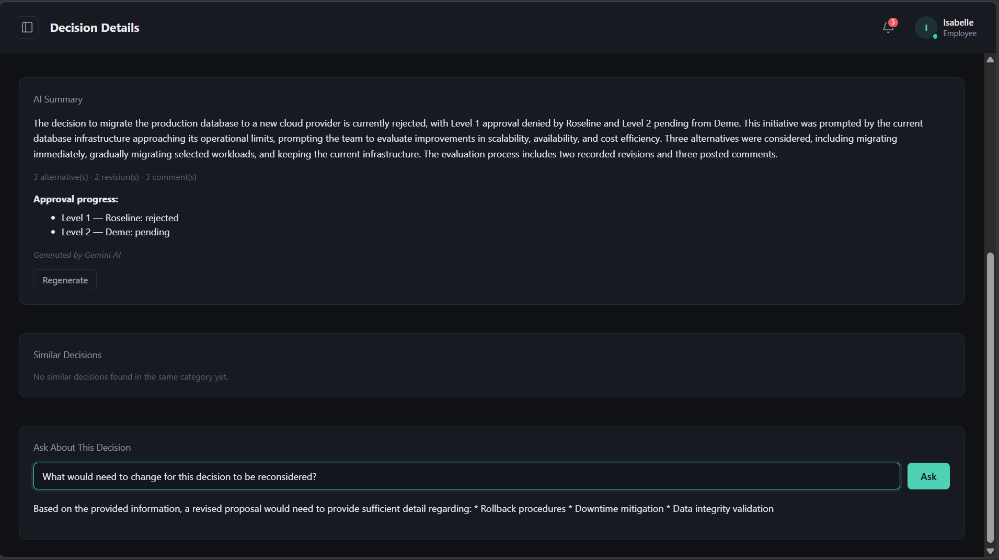

### AI Recommendation (Approval Intelligence)
The read-only AI recommendation shown to a Reviewer/Manager/Administrator, clearly labeled as advisory.

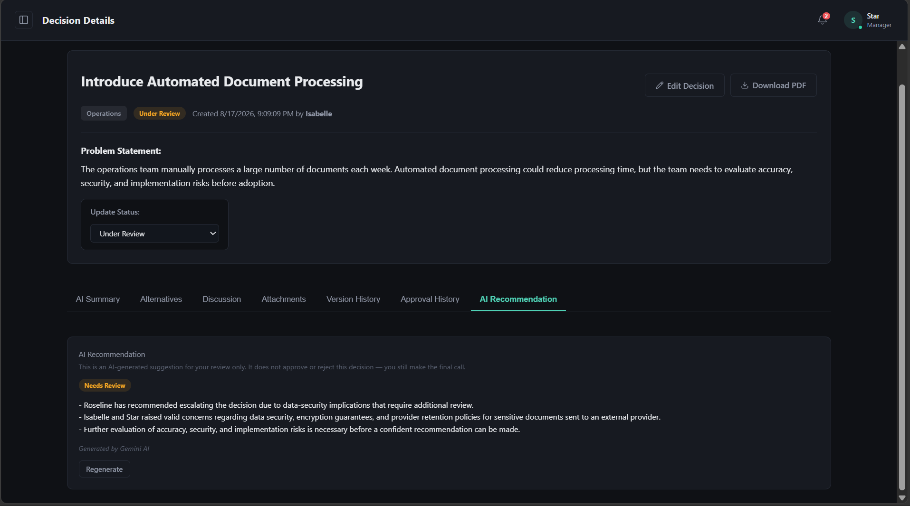

### AI Assistant (Persistent Conversations)
The general-purpose AI chat panel, showing conversation history loaded from the server.

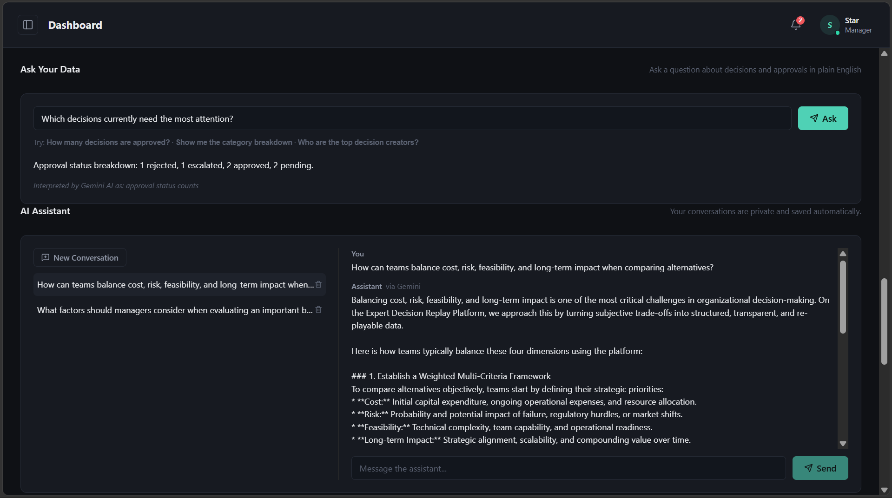

### AI Task Routing
The natural-language task-routing box, including the confirmation step before any reassignment/escalation executes.

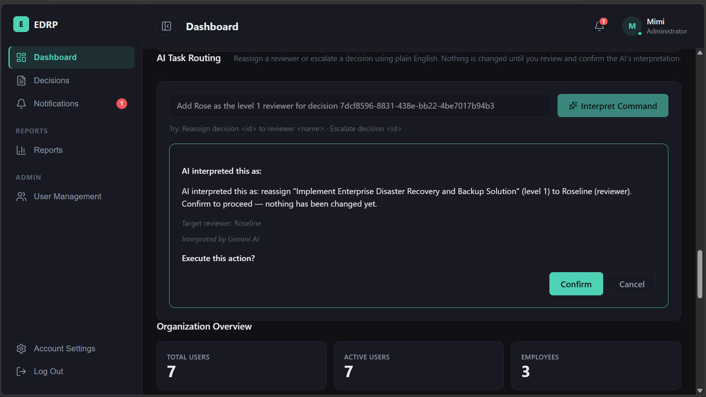

### Similar Decisions
The AI-suggested list of similar past decisions in the same category.

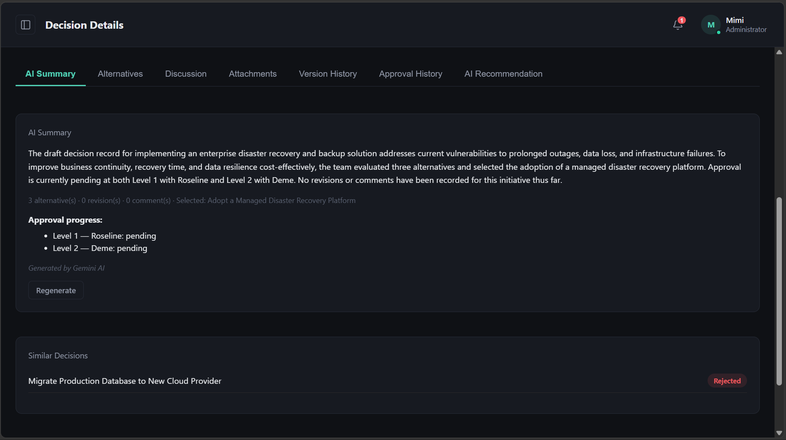

### Reports Overview
The Manager/Administrator reports landing area — summary, decision, approval, and team reports.

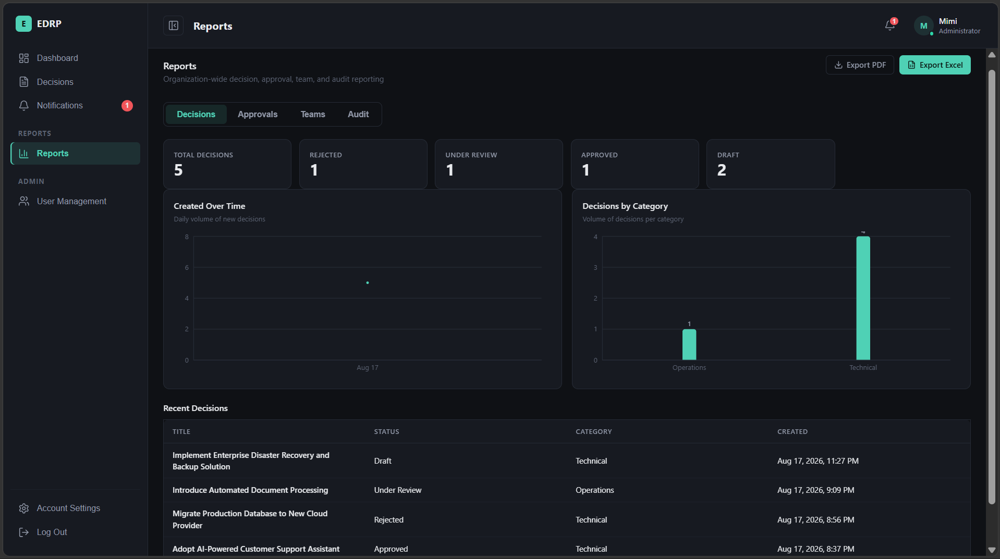

### Reports — Audit
The audit report view/export.

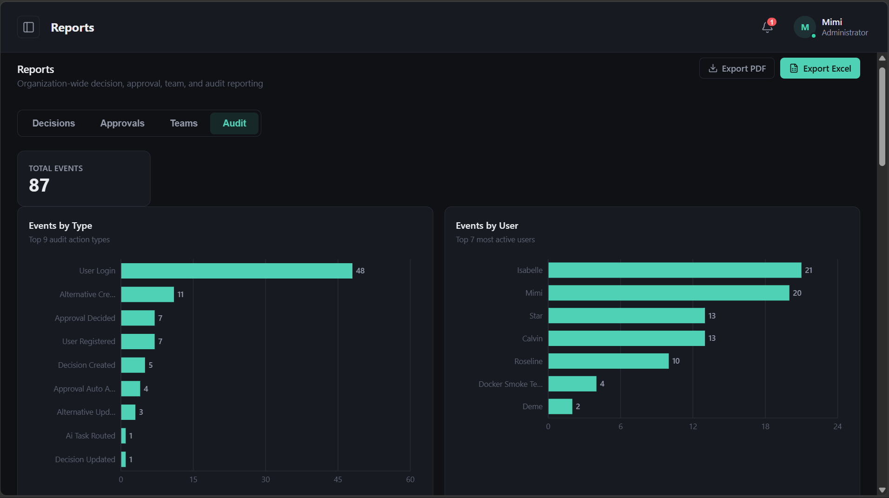

### User Management
Administrator user list/management view.

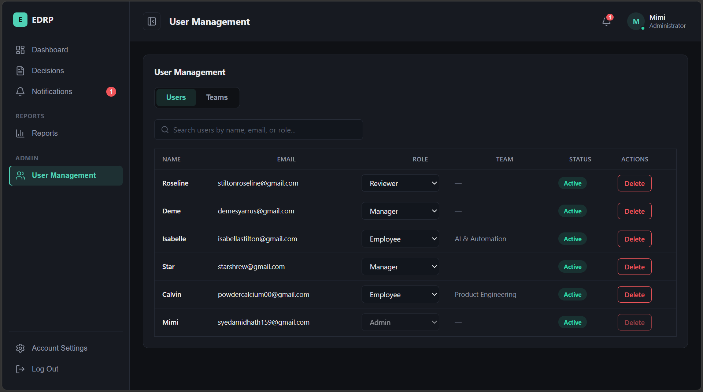

### Team Management
Manager/Administrator team creation and member management view.

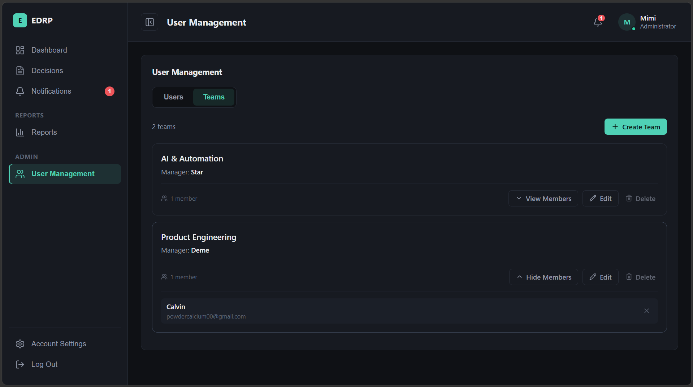

### My Team
A Manager's view of their own team's members.

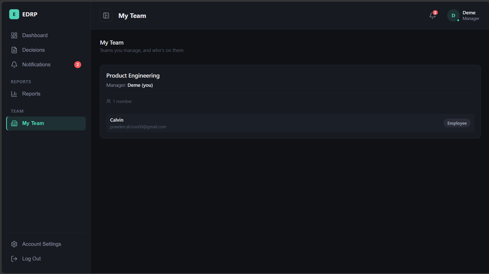

### Account Settings
Profile / change-password view.

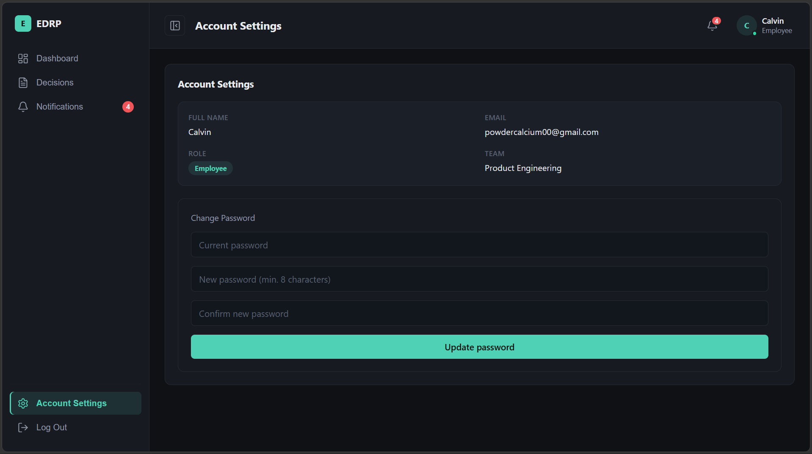

---

## Docker Deployment

Runs the full stack — Postgres, Redis, backend, frontend — locally with one command.

### Prerequisites
- Docker Desktop (or Docker Engine + Compose plugin) installed **and running**.
- A `backend/.env` file, created from `backend/.env.example`. At minimum it needs `SECRET_KEY`; everything else (`GOOGLE_API_KEY`, `GROQ_API_KEY`, `SMTP_*`, an external `REDIS_URL`) is optional and only enables its corresponding feature when set.

```bash
cp backend/.env.example backend/.env
# then edit backend/.env and fill in at least SECRET_KEY
```

`backend/.env` is gitignored and must never be committed. `DATABASE_URL`, `DB_SSL_REQUIRE`, and `REDIS_URL` in that file are overridden automatically by `docker-compose.yml` to point at the local Postgres/Redis containers — you don't need to edit them for Docker use.

### Build and start

```bash
docker compose up --build
```

On first boot the `backend` container waits for Postgres, runs its migrations (the schema-bootstrap lineage suited to a fresh database), seeds the four fixed roles (idempotent), then starts Uvicorn.

- Frontend: **http://localhost:5173**
- Backend / API docs: **http://localhost:8000/api/v1/docs**
- Backend health: **http://localhost:8000/api/v1/health**

### Normal day-to-day start/stop

```bash
docker compose up -d       # start in the background, without rebuilding
docker compose ps          # check container status/health
docker compose logs -f backend   # watch backend startup/migration logs
docker compose down        # stop and remove containers — named volumes (and their data) survive
```

> **To delete the local Postgres data and uploaded files `docker compose down -v`** — the `-v` flag also removes the named volumes (`pgdata`, `backend_uploads`), which is a genuine, irreversible local data loss, not just a container restart.

### What's persisted
- `pgdata` — the Postgres data directory.
- `backend_uploads` — uploaded attachments.
- Redis is **not** persisted — rate-limit counters are transient by design.

### Docker-local vs. external services
This stack is self-contained by default: Postgres and Redis run as local containers, regardless of what's in `backend/.env`. The real external `DATABASE_URL` (e.g. Neon) and `REDIS_URL` in `backend/.env` are left untouched and are exactly what's used when running the backend the non-Docker way — the two workflows don't interfere with each other.

---

## Local Development Setup

### Backend (against an external Postgres, e.g. Neon)

```bash
cd backend
python -m venv venv
venv\Scripts\activate        # Windows; use `source venv/bin/activate` on macOS/Linux
pip install -r requirements.txt

cp .env.example .env
# edit .env: DATABASE_URL (your Postgres), SECRET_KEY, and any optional keys

alembic upgrade fresh_local@head   # bootstraps a brand-new database's schema
python -m app.db.init_db           # seeds the four fixed roles (idempotent)

uvicorn app.main:app --reload
```

API docs at `http://localhost:8000/api/v1/docs`.

> This repository's migration history has two independent lineages — `fresh_local` (bootstraps an empty database from scratch) and `shared_legacy` (reconciles a specific pre-existing shared database). For a new/empty database, always target `fresh_local@head` explicitly rather than the bare `alembic upgrade head`.

### Frontend

```bash
cd frontend
npm install
npm run dev
```

Runs on `http://localhost:5173` by default and talks to the backend at `http://127.0.0.1:8000` unless `VITE_API_BASE_URL` is set otherwise.

---

## Environment Variables

`backend/.env.example` is the tracked, committed template — placeholder values only, safe to read. `backend/.env` is your real, local, gitignored copy of it; it must never contain values that get committed.

| Variable | Required | Purpose |
|---|---|---|
| `DATABASE_URL` | Yes | Async Postgres connection string (`postgresql+asyncpg://...`). |
| `DB_SSL_REQUIRE` | No (default `true`) | TLS for the DB connection — `true` for external Postgres (e.g. Neon), `false` for a local, non-TLS Postgres. |
| `SECRET_KEY` | Yes | JWT signing secret — at least 32 characters. |
| `ALGORITHM`, `ACCESS_TOKEN_EXPIRE_MINUTES`, `REFRESH_TOKEN_EXPIRE_DAYS` | No | JWT token configuration. |
| `BACKEND_CORS_ORIGINS` | No | Allowed frontend origin(s). |
| `GOOGLE_API_KEY`, `GEMINI_MODEL` | No | Enables Gemini-backed AI features. Every AI feature degrades to deterministic behavior when unset. |
| `GROQ_API_KEY`, `GROQ_MODEL` | No | Optional automatic fallback provider, tried only when Gemini fails. |
| `REDIS_URL` | No | Enables Redis-backed distributed rate limiting. Falls back to in-memory when unset or unreachable. |
| `SMTP_HOST`, `SMTP_PORT`, `SMTP_USERNAME`, `SMTP_PASSWORD`, `SMTP_FROM_EMAIL`, `SMTP_USE_TLS` | No | Enables email alerts. Skipped (with a logged warning) when unset. |
| `FRONTEND_BASE_URL` | No | Used to build links inside emails. |

No actual secret values are reproduced anywhere in this repository or its documentation — only variable names and their purpose.

---

## Testing & Verification

There is no automated test suite (`pytest`, etc.) in this repository at present. Verification performed during development was:

**Automated / scripted checks** (run repeatedly across development phases):
- `python -c "import app.main"` — the application imports and constructs cleanly.
- `app.openapi()` — the full route table builds without error (schema/response-model consistency check).
- `npm run build` — the frontend builds for production without errors.
- Standalone Python harnesses exercising service-layer logic directly (RBAC enforcement, ownership checks, Gemini→Groq→fail-soft fallback matrix, no-mutation guarantees) using dependency-injected fakes, since no live external test database was available for parts of development.

**Manual / live verification** (performed once against a real, disposable local Docker deployment — see [Docker Deployment](#docker-deployment)):
- Full `docker compose up --build` — all four services reaching a healthy state.
- Backend health endpoint and frontend both reachable and responding correctly.
- A real register → login → create decision → retrieve decision flow against the Docker Postgres database.
- A real AI conversation created and answered via a live Gemini call, and confirmed to persist across a full `docker compose down` / `docker compose up` cycle (i.e. surviving container recreation via the named Postgres volume).
- Redis-backed rate limiting confirmed via inspecting actual Redis keys (`ratelimit:user:<id>` vs `ratelimit:ip:<address>`), and the in-memory fallback confirmed by stopping the Redis container mid-session and observing requests continue to succeed.
- Role seeding, migration application, and table creation (including `ai_conversations`/`ai_messages`) confirmed directly against the Docker Postgres database.

This is real, evidence-based verification of the specific flows exercised — it is not a substitute for a proper automated test suite, which remains a known gap (see below).

---

## Project Structure

```
Expert-Decision-Replay-Platform-Group-2/
├── backend/
│   ├── app/
│   │   ├── core/            # security primitives (password hashing, token encode/decode)
│   │   ├── db/               # role-seeding script (init_db.py)
│   │   ├── dependencies/     # auth dependencies (get_current_user, require_role)
│   │   ├── middleware/       # Redis-backed rate limiter + in-memory fallback
│   │   ├── models/           # SQLAlchemy models (one entity per file)
│   │   ├── repositories/     # DB query layer, one per entity
│   │   ├── routers/          # FastAPI routers — thin HTTP layer only
│   │   ├── schemas/          # Pydantic request/response schemas
│   │   ├── services/         # business logic — the layer routers actually call into
│   │   ├── utils/            # shared exceptions, pagination helpers
│   │   ├── config.py         # Settings (env-driven)
│   │   ├── database.py       # async engine/session setup
│   │   └── main.py           # app construction, router registration, middleware
│   ├── alembic/               # migrations (two lineages — see Local Development Setup)
│   ├── requirements.txt
│   ├── Dockerfile
│   ├── entrypoint.sh          # wait-for-db → migrate → seed roles → start Uvicorn
│   └── wait_for_db.py
├── frontend/
│   ├── src/
│   │   ├── api/               # axios client
│   │   ├── components/        # reusable UI + feature components (charts, AI panels, etc.)
│   │   ├── pages/              # top-level routed views
│   │   ├── styles/
│   │   ├── App.jsx
│   │   └── main.jsx
│   ├── Dockerfile              # multi-stage: Vite build -> nginx
│   └── nginx.conf              # SPA fallback routing + asset caching
├── docs/
│   └── screenshots/            # see Screenshots section above 
├── docker-compose.yml
└── README.md
```

---

## Future Improvements / Known Limitations

- **No automated test suite.** Verification to date has been import/schema checks, targeted service-layer harnesses with dependency-injected fakes, and one live manual Docker smoke test — not a committed, repeatable `pytest` suite.
- **Two independent Alembic migration lineages exist** (`fresh_local` and `shared_legacy`) rather than one — a deliberate outcome of reconciling a fresh-database bootstrap path with a specific pre-existing shared database's own history, but it means `alembic upgrade head` (the bare keyword) is genuinely ambiguous and an explicit branch target is required.
- **AI conversation history is bounded** — only the most recent messages in a conversation are replayed into the prompt on each new turn; a very long conversation will lose earlier context rather than being summarized.
- **No full-text search** across decisions/conversations beyond the existing keyword-based decision search and NL-query intents.
- **No password-reset/forgot-password flow** is wired to the backend at this time.
- **Frontend bundle is not code-split** — Vite's build reports the main JS chunk over the default 500kB warning threshold; acceptable for current scale but a candidate for `dynamic import()`-based splitting later.
