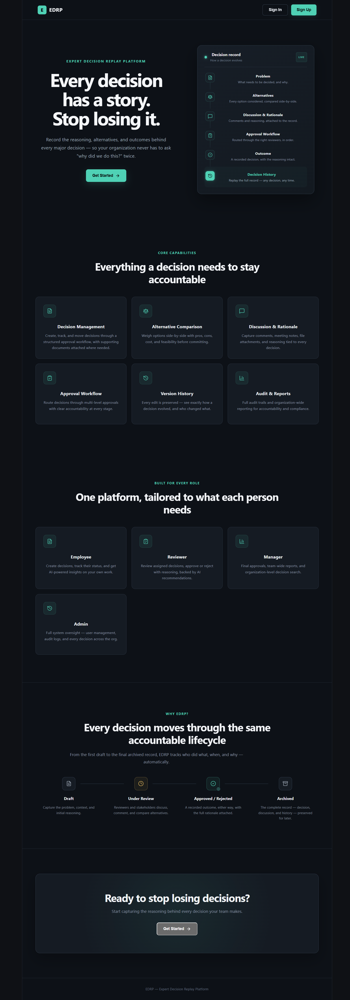
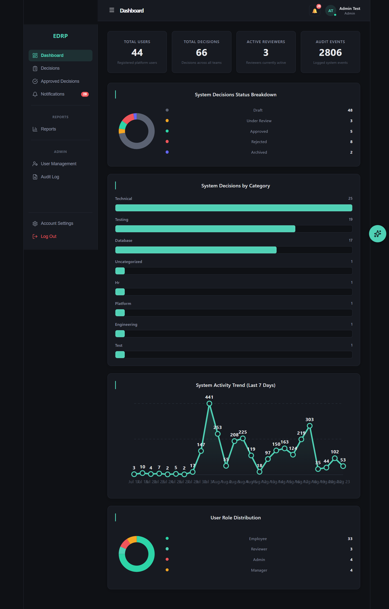
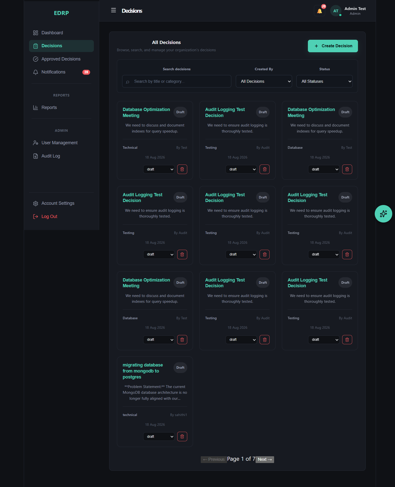
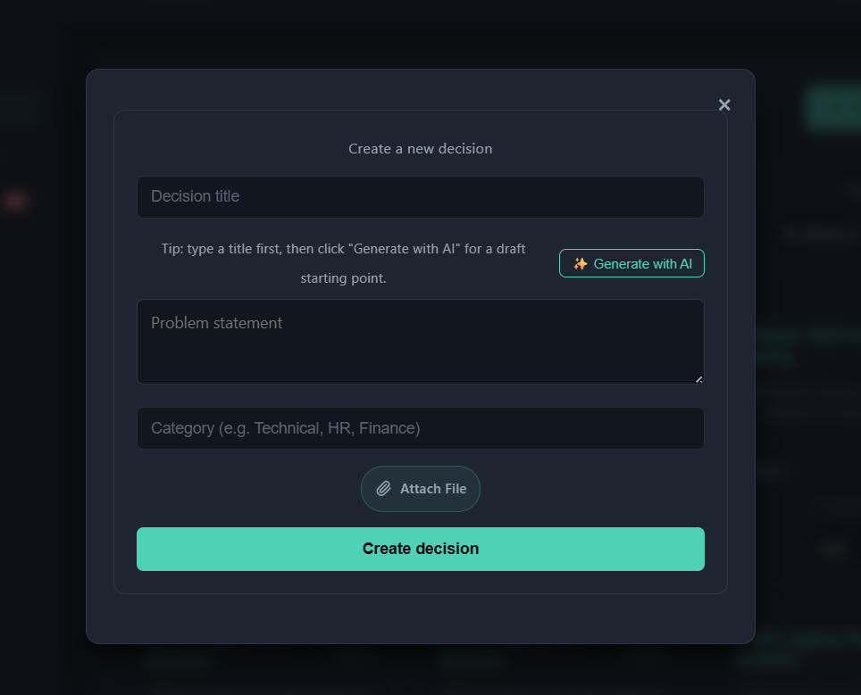
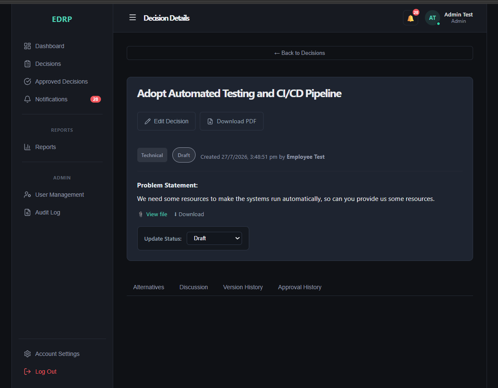
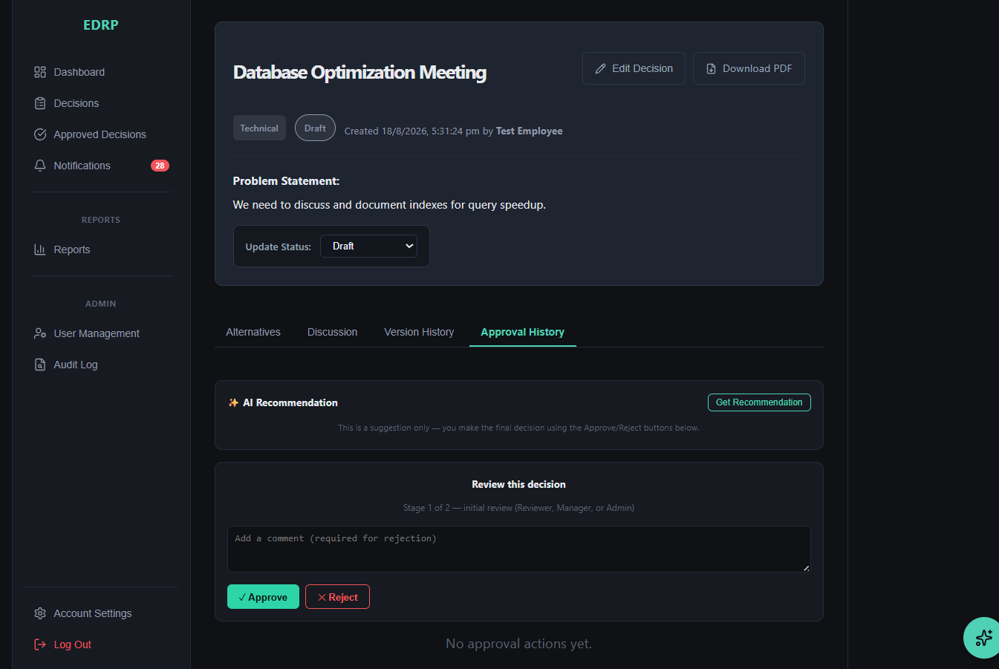
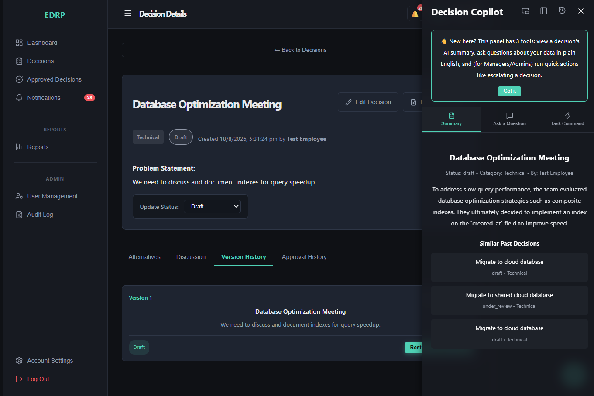
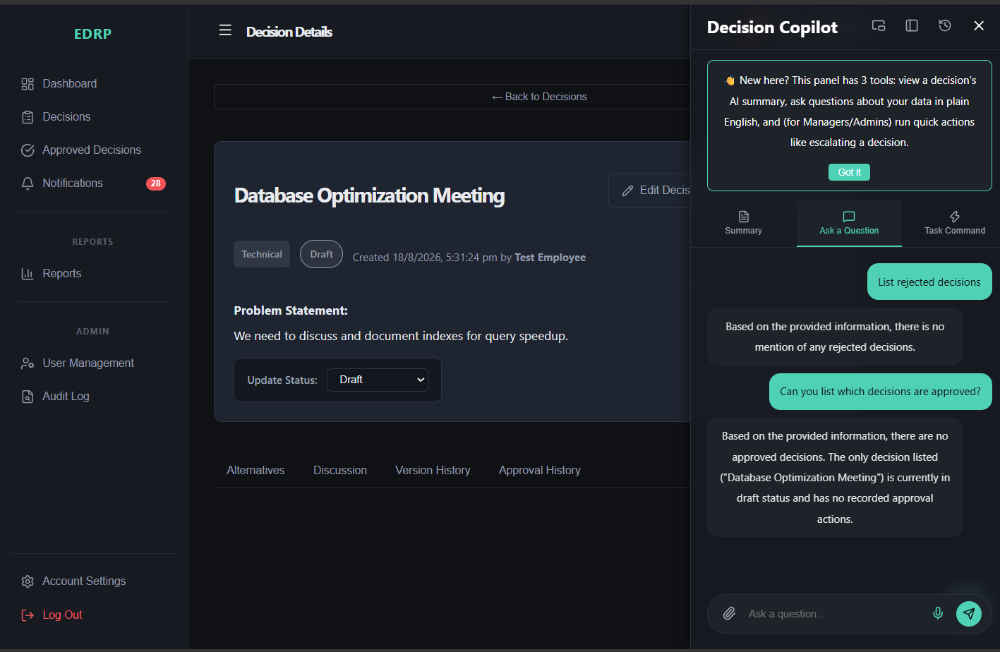
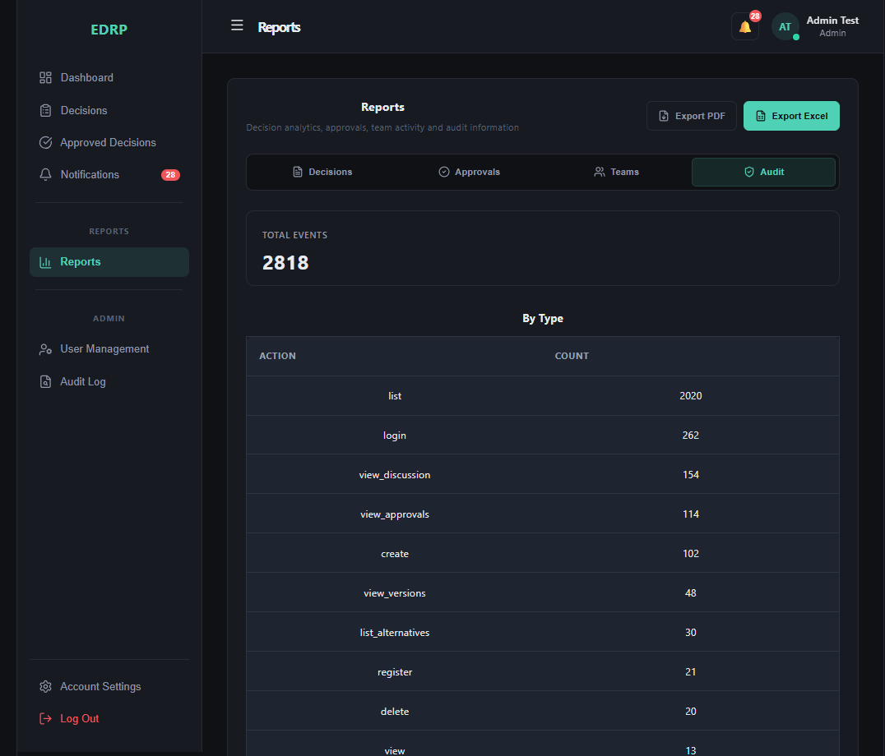
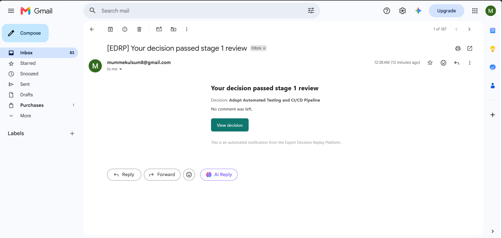

# Expert Decision Replay Platform (EDRP)

A centralized platform where organizations record important decisions — the problem, alternatives considered, discussions, approvals, and outcomes — so institutional knowledge is preserved and past mistakes aren't repeated.

Built as a college mentorship project (Springboard), Group 2, across four milestones.

---

## Table of Contents

1. [Objective](#objective)
2. [Tech Stack](#tech-stack)
3. [Architecture Overview](#architecture-overview)
4. [Features by Milestone](#features-by-milestone)
5. [AI Assistant — Full Feature Breakdown](#ai-assistant--full-feature-breakdown)
6. [Database Schema](#database-schema)
7. [Setup Instructions](#setup-instructions)
8. [Environment Variables](#environment-variables)
9. [Challenges Faced & How We Solved Them](#challenges-faced--how-we-solved-them)
10. [Screenshots](#screenshots)
11. [API Documentation](#api-documentation)
12. [Future Scope](#future-scope)

---

## Objective

Develop a centralized platform that records important organizational decisions — including the problem statement, alternatives, evaluation criteria, risks, stakeholders, discussions, approvals, implementation status, and final outcomes. The system lets organizations preserve institutional knowledge, review why past decisions were made, and avoid repeating mistakes.

Applicable to enterprises, consulting firms, engineering organizations, healthcare institutions, government departments, universities, and research organizations.

**Core outcomes:**
- Centralized decision management platform
- Secure authentication and role-based access
- Structured decision creation workflows
- Multi-level approval process
- Discussion and collaboration modules
- Complete decision history and audit logs
- Reports and organizational decision analytics
- AI-assisted insights and automation
- Docker-based deployment

---

## Tech Stack

**Backend:** Python, FastAPI, Uvicorn
**Frontend:** React (Vite)
**Database:** PostgreSQL (hosted on Neon), SQLAlchemy ORM, Alembic migrations
**Caching / Rate Limiting:** Redis
**Authentication:** JWT Bearer tokens, bcrypt password hashing
**File Storage:** Backblaze B2
**AI:** Google Gemini API (primary), Groq API (automatic fallback)
**Email:** Gmail SMTP
**PDF Generation:** ReportLab
**Excel Generation:** OpenPyXL
**Deployment:** Docker
**Version Control:** Git / GitHub (one branch per team member)

---

## Architecture Overview

```
┌─────────────────┐         ┌──────────────────┐         ┌─────────────────┐
│   React (Vite)   │  HTTP   │   FastAPI Backend │   SQL   │   PostgreSQL     │
│   Frontend       │────────▶│   (JWT Auth, RBAC)│────────▶│   (Neon Cloud)   │
└─────────────────┘         └──────────────────┘         └─────────────────┘
                                     │
                     ┌───────────────┼───────────────┬──────────────┐
                     ▼               ▼               ▼              ▼
              ┌────────────┐  ┌────────────┐  ┌────────────┐  ┌───────────┐
              │  Redis      │  │ Backblaze  │  │  Gemini /   │  │  Gmail    │
              │ (Rate Limit,│  │  B2        │  │  Groq API   │  │  SMTP     │
              │  Caching)   │  │ (Files)    │  │  (AI)       │  │  (Alerts) │
              └────────────┘  └────────────┘  └────────────┘  └───────────┘
```

Everything is packaged into a single Docker image that starts the database migrations, backend, and built frontend with one command.

---

## Features by Milestone

### Milestone 1 — Foundation
- Requirement analysis, database design, UI wireframes
- FastAPI + React project setup
- JWT authentication with bcrypt password hashing
- Role-based access control: Employee, Reviewer, Manager, Admin
- User management, first Admin seeded manually for security

### Milestone 2 — Decision Management
- Full decision CRUD with status workflow (draft → under review → approved/rejected → archived)
- Alternative Comparison (pros/cons, cost, risk, feasibility)
- Discussion Module (comments, threaded replies, meeting notes, attachments)
- File uploads via Backblaze B2
- Version Tracking — every edit snapshots the prior state
- PDF export of individual decisions

### Milestone 3 — Approval Workflow
- Multi-level approval (2-stage: Reviewer/Manager/Admin → Manager/Admin final)
- Category-based reviewer assignment
- No-self-approval rule
- Rejection with mandatory comment, resubmission with edit-enforcement
- Escalation detection for stuck decisions
- Audit logging (activity, security, access)
- Role-based dashboards with charts
- Reports module (Decision/Approval/Audit, PDF/Excel export)
- Team management (admin-managed teams, manager assignment, member management)
- Automatic Level-2 reviewer assignment based on team manager

### Milestone 4 — AI, Production Readiness & Deployment
- Full AI Assistant (see detailed breakdown below)
- API rate limiting (Redis-based)
- Email alerts for approval/rejection events (Gmail SMTP)
- Docker deployment — single container, single command, automatic migrations
- Database backup and restore scripts
- Role-based sidebar navigation — Reports and Audit Log are only visible to the roles that should see them (Manager/Admin and Admin respectively), demonstrating RBAC directly in the UI, not just the backend
- Collapsible, pinned sidebar with a fixed-position layout (no longer scrolls with page content)
- Approved Decisions and Audit Log added as direct sidebar shortcuts, reusing existing filtered views instead of duplicating logic
- Landing page role-preview section showing what each of the four roles can do

---

## AI Assistant — Full Feature Breakdown

Accessible as a floating, dockable, resizable panel available from anywhere in the dashboard.

| Feature | Description | Access |
|---|---|---|
| **Decision Summarization** | Generates a 2-sentence executive summary of any decision's problem and discussion | All roles |
| **Similar Past Decisions** | Finds related past decisions in the same category using AI-assisted matching | All roles |
| **Ask About This Decision** | Answers open-ended "why" questions about a specific decision using its real discussion/approval data | All roles |
| **NL-to-SQL Search** | Converts plain-English questions into safe, read-only SQL queries across all decisions, with follow-up context support | Manager/Admin |
| **Task Routing** | Executes commands like "escalate decision 34" or "reassign reviewer for decision 34 to user 5" | Manager/Admin |
| **Attach-File Q&A** | Upload a `.txt`, `.pdf`, `.jpg`, or `.png` and ask questions about its contents | All roles |
| **Approval Intelligence** | Recommends Approve/Reject with bullet-point reasoning based on alternatives, discussion, and similar past decisions. The AI never approves or rejects on its own — a human always makes the final call | Reviewer/Manager/Admin |
| **AI-Generated Problem Statement** | Drafts a starting problem statement from just a decision title | All roles |
| **Permanent Chat History** | Every question and answer is saved per user and browsable via a history dropdown | All roles |

**Reliability design:**
- Primary model: Google Gemini (`gemini-2.5-flash`)
- Automatic fallback to Groq (`llama-3.3-70b-versatile`) if Gemini's free-tier quota is exhausted
- AI-generated summaries are cached in the database and only regenerated when the underlying decision changes
- All rate-limit and error states are handled gracefully with clear in-app messaging, never a raw crash

**Safety design:**
- NL-to-SQL is restricted to `SELECT`-only queries against a fixed table whitelist; write operations are blocked in code, not just by prompting
- The AI never executes approval/rejection decisions — every AI recommendation requires explicit human confirmation
- "Ask About This Decision" is instructed to say "I don't know" rather than fabricate an answer when data is insufficient

---

## Database Schema

| Table | Purpose |
|---|---|
| `users` | Accounts, roles, team membership |
| `teams` | Team records with assigned manager |
| `decisions` | Core decision records with status, category, assigned reviewer |
| `alternatives` | Options considered per decision, with cost/risk/feasibility |
| `discussion_messages` | Threaded comments and meeting notes |
| `decision_versions` | Snapshot history of every edit |
| `approvals` | Approval/rejection/resubmission actions per stage |
| `reviewer_assignments` | Category → reviewer mapping |
| `audit_logs` | Activity, security, and access logs |
| `notifications` | In-app notifications |
| `chat_history` | Permanent AI Assistant conversation history per user |

---

## Setup Instructions

### Backend

```bash
cd backend
python -m venv venv
venv\Scripts\activate          # Windows
# source venv/bin/activate     # macOS/Linux

pip install -r requirements.txt

# Create a .env file (see Environment Variables below)

alembic upgrade head
uvicorn main:app --reload
```

Backend runs at `http://127.0.0.1:8000`. Interactive API docs at `http://127.0.0.1:8000/docs`.

### Frontend

```bash
cd frontend
npm install
npm run dev
```

Frontend runs at `http://localhost:5173`.

### Docker (single-command startup)

```bash
docker build -t edrp .
docker run -p 8000:8000 --env-file backend/.env edrp
```

Runs migrations, backend, and built frontend together on `http://localhost:8000`.

---

## Environment Variables

Create a `.env` file inside `backend/`:

```
DATABASE_URL=postgresql://...
SECRET_KEY=your_jwt_secret

B2_KEY_ID=your_backblaze_key_id
B2_APPLICATION_KEY=your_backblaze_key
B2_BUCKET_NAME=your_bucket_name

GEMINI_API_KEY=your_gemini_key
GROQ_API_KEY=your_groq_key

REDIS_URL=your_redis_connection_url

SMTP_HOST=smtp.gmail.com
SMTP_PORT=587
SMTP_USERNAME=your_email@gmail.com
SMTP_PASSWORD=your_gmail_app_password
SMTP_FROM_EMAIL=your_email@gmail.com
SMTP_USE_TLS=true

FRONTEND_BASE_URL=http://localhost:5173
```

---

## Challenges Faced & How We Solved Them

**1. bcrypt/passlib version incompatibility**
`bcrypt==5.0.0` broke passlib. Fixed by pinning `bcrypt==4.0.1`.

**2. Alembic "multiple heads"**
Two team members' migrations branched from the same point independently while working against a shared cloud database. Resolved with `alembic merge -m "..." <head1> <head2>`.

**3. Alembic autogenerate misses new Enum values**
Adding a value to an existing Postgres enum (e.g., a new `resubmitted` approval action) produces an empty migration. Fixed by manually writing `op.execute("ALTER TYPE approvalaction ADD VALUE IF NOT EXISTS 'resubmitted'")`.

**4. Route ordering bug**
`/decisions/escalations` was being swallowed by the more general `/decisions/{decision_id}` route, since FastAPI matches routes in definition order. Fixed by moving the specific route above the generic one.

**5. CORS blocking direct file downloads**
Browser `fetch()` couldn't follow the redirect to Backblaze B2 for forced downloads. Fixed by having the backend fetch the file itself and stream it to the browser with a `Content-Disposition: attachment` header.

**6. Gemini free-tier rate limits during heavy testing**
The free tier allows only 20 requests/day per model. Solved two ways: (a) caching AI summaries in the database so repeated views don't re-trigger generation, and (b) an automatic fallback to the Groq API when Gemini is exhausted, so the assistant keeps working without any cost.

**7. Timezone-aware vs. naive datetime comparison**
Comparing a cached timestamp against a database timestamp with mismatched timezone awareness caused a `TypeError` inside Docker. Fixed by normalizing both values to naive datetimes before comparison.

**8. Missing CA certificates inside the Docker image**
AI API calls (HTTPS) failed inside the container with an SSL protocol error because the slim base image lacked updated CA certificates. Fixed by installing and updating `ca-certificates` in the Dockerfile.

**9. Large-scale branch divergence**
One teammate's branch restructured the entire backend into a different folder architecture, causing dozens of merge conflicts. Rather than force a risky bulk merge, the specific needed feature (email service) was extracted and manually adapted into the existing structure, and the broader restructuring question was raised with the team for a deliberate decision.

**10. Merge conflicts across shared files**
With multiple people editing `main.py`, `models.py`, and migration files simultaneously, conflicts were resolved by manually combining both sides' genuine additions rather than picking one side, and verifying final state against the shared Neon database when in doubt.

---

## Screenshots

### Landing Page


### Admin Dashboard


### Decision List


### Create Decision (AI-Generated Problem Statement)


### Decision Details


### Approval Workflow with AI Recommendation


### AI Assistant — Summary


### AI Assistant — Ask a Question


### Reports — Audit Log


### Email Alert


---

## API Documentation

Full interactive API documentation (Swagger UI) is available at `/docs` when the backend is running, covering every endpoint including the AI Assistant routes (`/decisions/{id}/ai-summary`, `/decisions/{id}/ai-ask`, `/ai/ask`, `/ai/task`, `/decisions/{id}/ai-recommendation`, `/ai/generate-problem-statement`, `/ai/history`).

---

## Future Scope

- Vector search (`pgvector`) for semantic decision search instead of exact keyword matching
- Predictive analytics for risk and feasibility forecasting using historical metadata
- Multi-turn conversational AI assistant with full context memory
- Expanded email alert coverage (reviewer assignment, comments) to match in-app notifications
- Multi-factor authentication and CAPTCHA on login/registration
- Full-text search across attachments