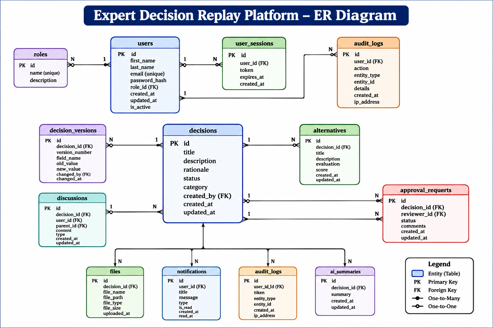

# Expert Decision Replay Platform

A production-quality platform for recording and replaying organizational decisions, preserving institutional knowledge for future employees.

## Project Overview

The "Expert Decision Review Platform" is a full-stack web application designed to provide a structured workflow for managing important decisions from creation through review and approval.

Instead of keeping decision reasoning scattered across documents, messages, or meetings, the platform brings important decision information into one centralized system.

The platform allows users to:

- Create and manage decisions
- Record decision context and rationale
- Add and compare alternative options
- Discuss decisions through threaded conversations
- Upload supporting documents
- Review and approve decisions
- Track decision changes through version history
- Generate concise AI-assisted decision summaries

The main goal of the platform is to make organizational decisions easier to "understand, review, track, and replay later".

The AI component is designed to assist users by summarizing existing decision information. It does not make new decisions or recommendations on behalf of the users.

## Project Objectives

The main objectives of the Expert Decision Review Platform are:

1. Provide a centralized location for recording organizational decisions.
2. Capture the context, reasoning, and rationale behind decisions.
3. Allow multiple alternatives to be evaluated and compared.
4. Support structured discussions between decision makers and reviewers.
5. Allow supporting documents to be attached to decisions.
6. Provide an approval and review workflow.
7. Maintain a history of changes made to important decision information.
8. Provide AI-assisted summaries of decision records.
9. Implement authentication and role-based authorization.
10. Provide a clean and user-friendly interface for managing the complete decision lifecycle.

##  Key Features

- Decision Management
  - Create, view, update, and delete organizational decisions.
  - Track the complete lifecycle of a decision through different statuses.
  - Maintain decision context, problem statements, and supporting information.

- Alternative Evaluation
  - Add and manage multiple alternatives for each decision.
  - Compare alternatives based on evaluation criteria.
  - Visualize alternative comparisons to support better decision-making.

- Discussion & Collaboration
  - Add comments and discussion threads to decisions.
  - Reply to existing discussions.
  - Record rationales, meeting notes, questions, and important decision context.

- Approval Workflow
  - Submit decisions for review and approval.
  - Support role-based approval workflows.
  - Allow authorized reviewers and managers to review decisions before finalization.

- Audit Logs
  - Maintain a record of important activities performed on decisions.
  - Track changes made to decision information and status.
  - Provide transparency and accountability by recording user actions.
  - Support decision traceability throughout the decision lifecycle.

- Version History
  - Maintain historical versions of decision information.
  - Track which fields were changed and how they changed.
  - Record the user and timestamp associated with updates.
  - Enable users to understand how a decision evolved over time.

- Dashboard
  - Provide a centralized overview of organizational decisions.
  - Display decision-related statistics and important information.
  - Help users quickly monitor decision statuses and activity.
  - Provide an at-a-glance view of the decision-making process.

- Notifications
  - Notify relevant users about important decision-related activities.
  - Support notifications for workflow and approval-related events.
  - Keep users informed about updates that require their attention.

- Role-Based Access Control
  - Support different user roles such as Administrator, Manager, Reviewer, and Employee.
  - Restrict actions based on user permissions.
  - Protect sensitive decision and workflow operations.

- Document Management
  - Upload and attach supporting documents to decisions.
  - View and manage files associated with a decision.
  - Allow authorized users to delete attached documents.

- AI-Powered Decision Summaries
  - Generate concise summaries of decision information using AI.
  - Reduce the time required to understand complex decision records.
  - Provide a quick overview of important decision context and information.

- Secure Authentication
  - Authenticate users before accessing protected functionality.
  - Use authorization mechanisms to protect backend APIs.
  - Ensure users can only perform actions permitted by their roles.

- REST API Backend
  - Provide structured APIs for decisions, alternatives, discussions, files, approvals, users, and AI services.
  - Enable communication between the frontend and backend application.
  - Support scalable integration between different application modules.

- Interactive Frontend
  - Provide a responsive web interface for managing decisions.
  - Use reusable UI components for forms, cards, modals, status badges, charts, and lists.
  - Provide a structured workflow for creating, reviewing, and managing decisions.

## Technology Stack

### Frontend

- React
- TypeScript
- React Router
- Tailwind CSS
- Axios / API service modules
- Reusable React components

### Backend

- Python
- FastAPI
- SQLAlchemy
- REST APIs
- JWT-based authentication
- Role-based authorization

### Database

- PostgreSQL
- Neon PostgreSQL
- SQLAlchemy ORM

### AI Integration

- Hugging Face Inference Client
- Hugging Face Inference Providers / endpoints
- AI-assisted decision summarization

### Development Tools

- Visual Studio Code
- Git / GitHub
- Uvicorn
- Python Virtual Environment
- FastAPI Swagger / OpenAPI documentation

## System Architecture

The Expert Decision Review Platform follows a client-server architecture.

The React frontend communicates with the FastAPI backend through REST APIs. The backend contains the application's business logic and communicates with PostgreSQL using SQLAlchemy. The AI service communicates with Hugging Face when an AI-generated decision summary is requested.

### Architecture Diagram


### Architecture Flow

```text
User
  |
  v
React + TypeScript Frontend
  |
  | REST / HTTP
  v
FastAPI Backend
  |
  +------------------------+
  |                        |
  v                        v
PostgreSQL / Neon        AI Service
                            |
                            v
                    Hugging Face Inference

                    Main Architectural Components
Frontend Layer

The frontend is developed using React and TypeScript.

It contains pages and reusable components responsible for displaying information and interacting with users.

Important frontend areas include:

Decision pages
Decision detail page
Alternative components
Discussion components
File components
Approval pages
Reusable UI components
API Layer

The FastAPI backend exposes REST APIs for the major application modules, including:

Authentication
Users
Decisions
Alternatives
Discussions
Files
Approvals
AI summaries
Service Layer

The backend contains service classes that implement application-specific business logic.

backend/
└── app/
    └── services/
        └── ai_service.py

The AI service retrieves decision information, prepares the AI prompt, communicates with the inference provider, and returns the generated summary.

Database Layer:

PostgreSQL is used for persistent application data.

SQLAlchemy acts as the ORM layer between the FastAPI application and PostgreSQL.

AI Layer:

The AI service communicates with Hugging Face inference services to generate concise summaries from existing decision information.

The AI component assists with summarization and does not replace human decision-making.

## Entity Relationship Diagram

The database is centered around the `Decision` entity. Other entities such as alternatives, discussions, files, approvals, and version history are associated with decisions.

### ER Diagram


### Core Relationships

```text
User
 |
 | creates
 v
Decision
 |       |        |          |
 |       |        |          |
 v       v        v          v
Alternative  Discussion   Files   Version History
                             
Decision
   |
   v
Approvals

Main Entities
User

Stores information about users and their roles within the platform.

Decision

Represents the central decision record.

It contains information such as:

Decision ID
Title
Description
Rationale
Status
Category
Creator
Creation date
Alternative

Stores alternative options associated with a decision and their evaluation information.

Discussion

Stores comments and discussions related to a decision.

Discussions can also support replies through parent-child relationships.

File

Stores information about documents attached to decisions.

Approval

Stores information related to the decision approval and review workflow.

Version History

Stores information about changes made to decision records, allowing users to track how decision information changed over time

## Project Structure

The project is organized into separate frontend and backend applications.

```text
Expert-Decision-Replay-Platform-Group-2/
│
├── backend/
│   ├── app/
│   │   ├── api/
│   │   ├── models/
│   │   ├── schemas/
│   │   ├── services/
│   │   │   └── ai_service.py
│   │   ├── exceptions/
│   │   └── main.py
│   │
│   ├── requirements.txt
│   └── .env
│
├── frontend/
│   ├── src/
│   │   ├── api/
│   │   ├── components/
│   │   ├── contexts/
│   │   ├── pages/
│   │   │   ├── DecisionDetailPage.tsx
│   │   │   └── DecisionsPage.tsx
│   │   ├── types/
│   │   └── utils/
│   │
│   └── package.json
│
├── images/
│   ├── architecture-diagram.png
│   └── er-diagram.png
│
└── README.md


## Decision Workflow

The general decision workflow implemented by the platform is:

```text
Create Decision
      |
      v
Add Context / Rationale
      |
      v
Add Alternatives
      |
      v
Compare Alternatives
      |
      v
Reviewer Discussion
      |
      v
Approval / Review
      |
      v
Status Update
      |
      v
Decision History
      |
      v
AI Summary / Decision Replay


## AI Decision Summary

The platform includes an AI-assisted decision summarization feature.

The AI feature is designed to summarize existing decision information rather than make decisions for users.

### AI Workflow

```text
User requests summary
        |
        v
FastAPI AI Endpoint
        |
        v
AIService
        |
        v
Retrieve Decision from Database
        |
        v
Prepare Controlled Prompt
        |
        v
Hugging Face Inference
        |
        v
Generated Summary
        |
        v
Return Summary to Frontend

Information Provided to the AI

The AI service uses information from the decision record, including:

Decision ID
Title
Description
Rationale
Current Status
Summary Format

The generated summary is requested in three sections:

Decision Overview
Key Considerations
Current Status
AI Safety Instructions

The AI service is instructed to:

Keep the summary factual.
Avoid inventing information.
Avoid making a new recommendation.
Only summarize information provided in the decision.
Keep the summary concise.
Keep the entire summary under 250 words.

This ensures that the AI is used as an assistance tool while the actual decision remains under human control.


## Authentication and Authorization


The application uses authentication and role-based authorization to control access to protected operations.


Authenticated requests use an authorization token.

Example:

```http
Authorization: Bearer <access-token>

The application supports different user roles, including:

Administrator
Manager
Reviewer

Permissions are based on the user's role and relationship to the decision.

For example, the frontend uses role information to determine whether a user can:

Edit a decision
Delete a decision
Access approvals
Review decision information
Perform other protected operations

Authorization is also enforced at the backend API level so that security does not depend only on hiding buttons in the frontend.

## API Design

The backend provides REST APIs for the major modules of the platform.

The main API areas include:

```text
/api/auth/...
/api/users/...
/api/decisions/...
/api/alternatives/...
/api/discussions/...
/api/files/...
/api/approvals/...
/api/ai/...

AI Summary Endpoint

The AI summary functionality is exposed through an endpoint similar to:

POST /api/ai/decision/{decision_id}/summary

The endpoint receives a decision ID, retrieves the corresponding decision, generates an AI summary, and returns the result.

API Documentation

FastAPI automatically generates interactive Swagger/OpenAPI documentation.

When running locally, it can be accessed at:

http://127.0.0.1:8000/docs

The Swagger interface can be used to test the backend endpoints during development.

## Environment Configuration

Sensitive information such as database credentials, secret keys, and AI provider tokens should not be hard-coded in the application source code.

The backend uses environment variables for configuration.

## Installation and Setup

### Backend Setup

Open a terminal and navigate to the backend directory:

```bash
cd backend
Create a Python virtual environment:

python -m venv venv

Activate the virtual environment on Windows:

venv\Scripts\activate

Install the required dependencies:

pip install -r requirements.txt

Configure the required environment variables.

Start the FastAPI development server:

uvicorn app.main:app --reload

The backend will normally be available at:

http://127.0.0.1:8000

Swagger API documentation:

http://127.0.0.1:8000/docs

Frontend Setup:

Open another terminal and navigate to the frontend directory:

cd frontend

Install dependencies:

npm install

Start the frontend development server:

npm run dev

Open the URL displayed by the frontend development server in the browser.

## Challenges Faced and Solutions


During the development of the Expert Decision Review Platform, several technical and integration challenges were encountered.


### Challenge 1 — AI API Quota Issue


Initially, the AI functionality was integrated using the OpenAI API.


During testing, the API returned a `429` error indicating insufficient quota:


```text
Error code: 429
insufficient_quota

This prevented the application from generating AI summaries.

Solution

To continue development without depending on paid OpenAI API credits, the AI integration was moved to Hugging Face inference.

The backend was updated to use:

from huggingface_hub import InferenceClient

A Hugging Face access token was configured through an environment variable.

This allowed the AI summarization feature to continue development using the available Hugging Face inference options.

Challenge 2 — Environment Variable Configuration

After changing the AI provider, the backend initially returned:

HUGGINGFACE_API_KEY is not configured

The issue occurred because the backend process could not find the required environment variable.

Solution

The AI service was configured to read the Hugging Face token from the environment.

For example:

hf_token = (
    os.getenv("HUGGINGFACE_API_KEY")
    or os.getenv("HF_TOKEN")
)

The token was then added to the backend environment configuration.

This approach also prevents the secret from being hard-coded in the source code.

Challenge 3 — Development Server Reload Problems

While modifying backend files, Uvicorn's automatic reload displayed messages such as:

WatchFiles detected changes...
Reloading...

The reload process also stopped with a KeyboardInterrupt during development.

Solution

The development server was restarted after backend changes and dependencies were checked.

The --reload option was retained for development because it automatically detects source-code changes.

For production deployment, a production-ready server configuration should be used.

Challenge 4 — Frontend and Backend Integration

The platform contains multiple frontend pages and API modules. Adding a new AI feature required connecting the frontend, backend endpoint, AI service, and external inference provider.

Solution

A layered integration approach was followed:

React Page
   |
   v
Frontend API Module
   |
   v
FastAPI Endpoint
   |
   v
Backend AI Service
   |
   v
Hugging Face Inference

This keeps the AI provider logic inside the backend instead of placing external API logic directly inside React components.

Challenge 5 — Preventing AI Hallucination

An AI model may generate information that was not present in the original decision.

This is particularly important for a decision-review system because inaccurate information could affect how a decision is understood.

Solution

The AI prompt was designed with explicit constraints:

Keep it factual.
Do not invent information that is not provided.
Do not make a new recommendation.

The model is given only the relevant decision information and is instructed to summarize it instead of generating new conclusions.

Challenge 6 — Role-Based Access

Different users require different levels of access.

For example, administrators and managers may have permissions that ordinary users do not have.

Solution

Role-based authorization was implemented.

The frontend checks authenticated user roles to control the availability of actions such as editing, deleting, and accessing approval workflows.

The backend also protects sensitive operations so authorization does not depend only on frontend UI restrictions.

Challenge 7 — Managing Multiple Related Data Sources

The decision detail page requires information from several resources:

Decision
Alternatives
Discussions
Files
Version history
Reviewers

Loading all these resources individually could make the page logic complicated and slower.

Solution

The frontend uses Promise.all() to load independent resources concurrently.

Example:

const [
  decRes,
  altRes,
  discRes,
  fileRes,
  histRes
] = await Promise.all([
  decisionsApi.get(decisionId),
  alternativesApi.list(decisionId),
  discussionsApi.list(decisionId),
  filesApi.list(decisionId),
  decisionsApi.getHistory(decisionId),
]);

This keeps the loading logic centralized and allows independent requests to execute concurrently

## Security

Security was a major consideration in the development of the Expert Decision Replay Platform. The application implements multiple security measures to protect user accounts, decision data, and API endpoints.

### Security Measures

- **JWT Authentication**  
  JSON Web Tokens (JWT) are used to securely authenticate users and maintain authenticated sessions.

- **Role-Based Access Control (RBAC)**  
  Access to platform features and resources is controlled based on user roles such as Administrator, Manager, Reviewer, and regular users.

- **Password Security**  
  User passwords are securely hashed before being stored in the database.

- **CAPTCHA Protection**  
  CAPTCHA has been integrated into the authentication workflow to help prevent automated bot activity, brute-force attempts, and fake account submissions.

- **API Authorization**  
  Protected API endpoints require valid authentication tokens before allowing access to sensitive operations.

- **Input Validation**  
  User inputs are validated on the backend to reduce invalid or potentially malicious requests.

- **Protected Decision Data**  
  Decision records, alternatives, discussions, files, approvals, and other sensitive resources are accessible according to the user's permissions.

- **Audit Logs**  
  Important activities and changes are recorded through audit logging to provide traceability and accountability.

- **Secure File Handling**  
  Uploaded files are handled through dedicated file-management APIs with authorization checks.

- **Environment Variables for Secrets**  
  Sensitive configuration such as API keys, authentication secrets, and external service credentials are stored using environment variables rather than being hard-coded in the source code.

### CAPTCHA

CAPTCHA is used as an additional security layer in the authentication process. It helps distinguish legitimate users from automated scripts and reduces the risk of:

- Automated login attempts
- Bot registrations
- Brute-force attacks
- Automated abuse of authentication endpoints
- Spam requests

Together, these security mechanisms provide multiple layers of protection for the platform and its users.

## Testing Strategy

The application can be tested at both the backend API level and the frontend UI level.

### Backend API Testing

FastAPI Swagger/OpenAPI documentation can be used to test endpoints:

```text
http://127.0.0.1:8000/docs

Important test scenarios include:

User authentication
Creating a decision
Retrieving a decision
Updating a decision
Changing decision status
Adding an alternative
Updating an alternative
Posting a discussion
Replying to a discussion
Uploading a file
Approval workflow
Generating an AI summary
Frontend Testing

Important frontend flows include:

Login
Decision listing
Decision detail view
Editing a decision
Adding alternatives
Comparing alternatives
Posting discussions
Uploading documents
Viewing version history
Accessing approval workflows
Generating AI summaries
AI Testing

The AI summary should be checked for:

Factual accuracy
Correct decision information
No invented facts
No new recommendations
Correct three-section structure
Concise output
Appropriate error handling when the AI provider is unavailable


## Future Enhancements


The platform can be extended with several additional capabilities in the future:


- Store generated AI summaries in the database
- Maintain AI summary history
- AI-assisted comparison of alternatives
- Automatic identification of decision risks
- Decision similarity and search
- Advanced analytics dashboards
- Email and notification workflows
- More detailed audit logs
- Automated unit and integration testing
- Background processing for AI operations
- Improved document processing
- Fine-grained permissions
- Production deployment and monitoring
- Decision replay analytics

## Project Benefits

### Better Decision Traceability

The platform allows users to understand not only what decision was made, but also the context and reasoning behind it.

### Improved Collaboration

Reviewers and decision makers can communicate through structured discussions associated with each decision.

### Centralized Evidence

Supporting documents can be attached directly to the relevant decision.

### Historical Tracking

Version history makes it possible to understand how decision information changed over time.

### Faster Review

AI-generated summaries provide a concise starting point for reviewing decision records.

### Human-Centered AI

The AI is used as a summarization assistant rather than as an autonomous decision-maker.

### Structured Decision Management

The platform brings decisions, alternatives, discussions, approvals, files, and history into one centralized workflow.

## Conclusion

The **Expert Decision Review Platform** provides a structured system for managing the complete lifecycle of expert decisions.

The platform combines modern full-stack technologies including React, TypeScript, FastAPI, Python, PostgreSQL, SQLAlchemy, and Hugging Face AI inference.

It provides functionality for:

- Decision management
- Alternative evaluation
- Reviewer discussions
- Document management
- Approval workflows
- Version history
- AI-assisted decision summaries
- Authentication and role-based authorization

The project demonstrates how AI can be integrated into a business application as an assistance tool while keeping the final decision-making process under human control.

By maintaining decision context, alternatives, discussions, supporting documents, approvals, and historical changes in one system, the platform makes decisions easier to understand, review, and revisit in the future.
