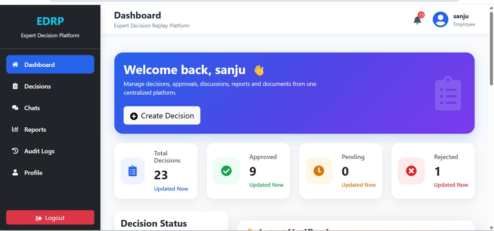
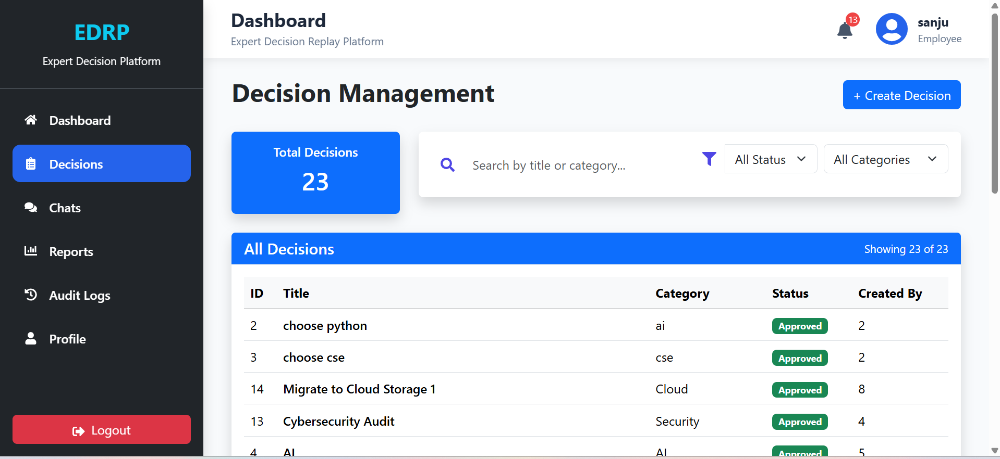
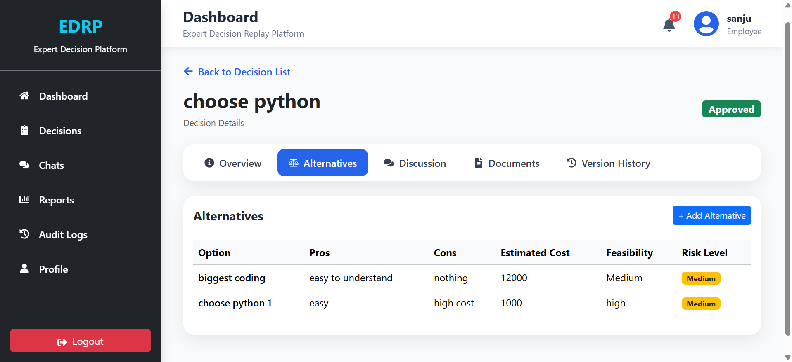
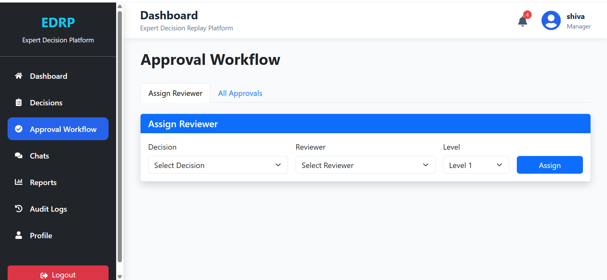
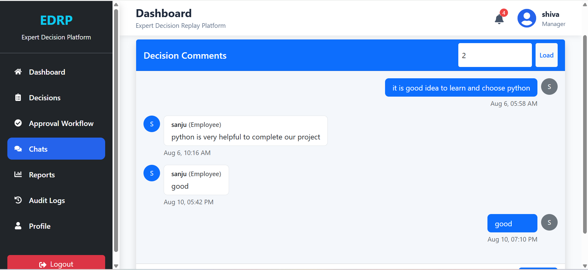
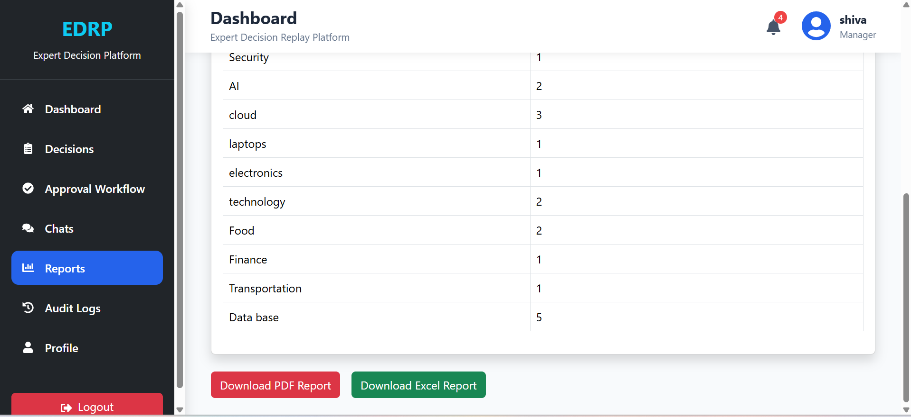
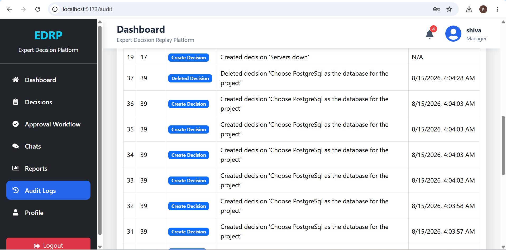
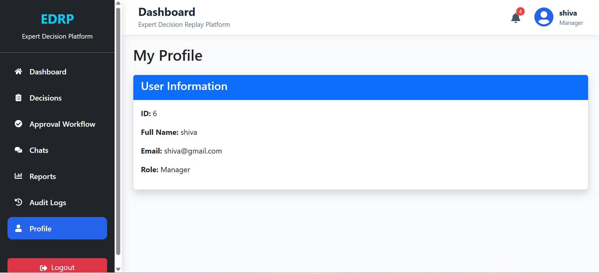
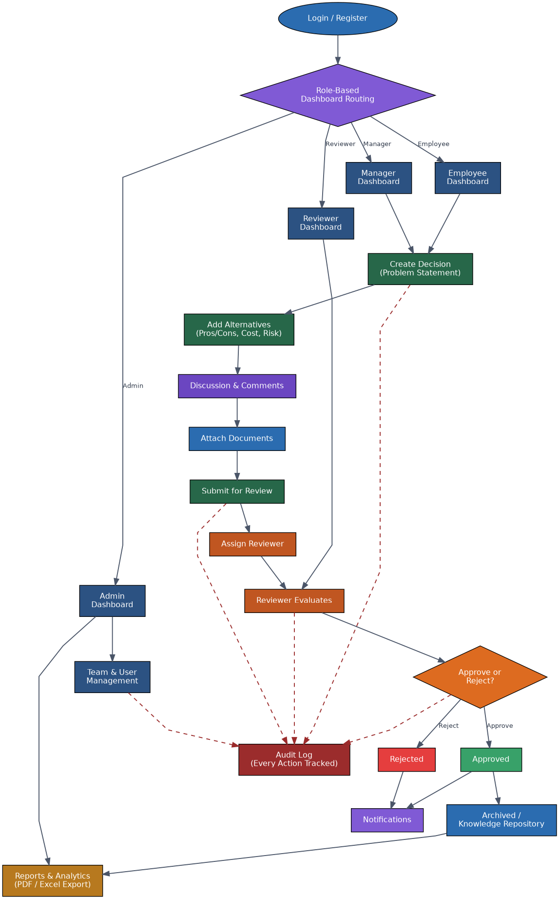
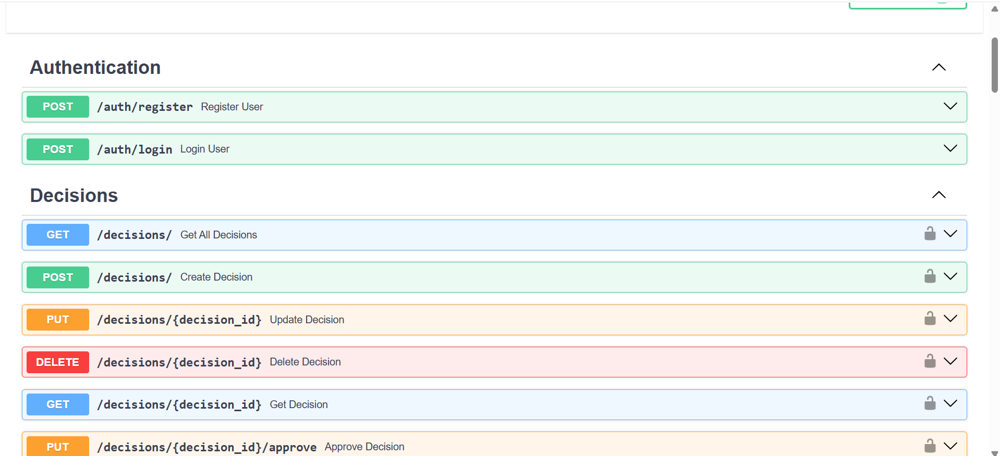

# Expert-Decision-Replay-Platform-Group-2
A centralized platform to record, discuss, approve, and archive organizational decisions — preserving institutional knowledge so teams understand why a decision was made and avoid repeating past mistakes.


##  Overview
The Expert Decision Replay Platform (EDRP) is a decision-management system that captures the full lifecycle of an organizational decision: the problem statement, alternatives considered, evaluation criteria, risks, stakeholders, discussions, approvals, implementation status, and final outcome.
It supports structured decision documentation, multi-level approval workflows, document management, discussion threads,        version history, audit logs, and reporting — built for enterprises, consulting firms, engineering teams, healthcare institutions, government departments, and research organizations.

##  Key Features
- 📝 Capture and document critical decisions with full context
- ⚖️ Track alternatives, pros/cons, cost comparison, and risk assessment
- 💬 Collaborate through comments and discussion threads
- ✅ Multi-level approval workflow with reviewer assignment
- 🔍 Search and reuse past decisions (knowledge repository)
- 📜 Full audit trail and compliance logs
- 📊 Reports, analytics, and export (PDF/Excel)

## Technology Used
**Backend**
- Python 3.x
- FastAPI — REST API framework
- Uvicorn — ASGI server
- SQLAlchemy — ORM
- Alembic — Database migrations
- Pydantic — Data validation & settings management
- JWT — Authentication & authorization
  
**Frontend**
- React (Vite)
- Axios — API client
- CSS (App.css, Auth.css)
  
**Database & Storage**
- PostgreSQL — Relational database
- Local/Cloud file storage — Document uploads
  
**DevOps & Tools**
- Docker — Containerization
- GitHub & GitHub Actions — Version control & CI/CD
- Postman — API testing
- HTTPS/SSL — Secure communication

## Architecture
  

## Layers 
- Users — Employees, Reviewers, Managers, Administrators
- Application Layer — Authentication (JWT), Authorization & Access Control, Session Management, File Management, Audit                             Logging
- Business Modules — User Management, Decision Management, Alternative Analysis, Discussion, Approval Workflow, Knowledge                         Repository, Reports & Analytics, Audit & Compliance
- Data Layer — PostgreSQL, File Storage, Activity & Audit Logs, Scheduled Backups
- Infrastructure — Python 3.x, FastAPI, Uvicorn, Docker, HTTPS/SSL, Monitoring
  
## Roles & Permissions
Role and Access

Employee | Create/view decisions, participate in discussions. No approval/reject controls — approval actions are not shown on their screen. |
Manager| Standard registered role with dashboard and reporting access alongside decision creation and discussion. |
Reviewer| Sees the Approval Workflow, but only decisions assigned to them (their own pending/approved items). Can leave a comment and then approve or reject. |
Administrator| Full access — Approval Workflow across all decisions plus Team/User Management (assign roles, manage users). |

```
backend/
├── app/
│   ├── main.py                    # App entrypoint, registers all routers
│   ├── database.py                # DB engine/session setup
│   ├── audit_logger.py            # Centralized audit logging helper
│   │
│   ├── api/
│   │   ├── auth.py                # Register, login endpoints
│   │   ├── user.py                # Profile, admin user list, roles
│   │   ├── decision.py            # Decision CRUD, search, status
│   │   ├── alternative.py         # Alternatives nested under decisions
│   │   ├── approval.py            # Multi-level approval workflow
│   │   ├── comment.py             # Discussion threads
│   │   ├── history.py             # Decision version history
│   │   ├── notification.py        # In-app notifications
│   │   ├── report.py              # Analytics & report generation
│   │   └── audit.py               # Audit log endpoints
│   │
│   ├── auth/
│   │   ├── security.py            # Password hashing, JWT handling
│   │   └── dependencies.py        # Auth guards, get_current_user
│   │
│   ├── core/
│   │   ├── config.py              # Settings (.env loading via pydantic)
│   │   └── dependencies.py        # Shared FastAPI dependencies
│   │
│   ├── database/
│   │   ├── models/
│   │   │   ├── user.py
│   │   │   ├── team.py
│   │   │   ├── decision.py
│   │   │   ├── alternative.py
│   │   │   ├── approval.py
│   │   │   ├── comment.py
│   │   │   ├── document.py
│   │   │   ├── decision_document.py
│   │   │   ├── decision_history.py
│   │   │   ├── decision_version.py
│   │   │   ├── audit_log.py
│   │   │   ├── notification.py
│   │   │   └── ai_review.py
│   │   │
│   │   └── schemas/
│   │       ├── decision.py        # Pydantic request/response models
│   │       ├── alternative.py
│   │       ├── approval.py
│   │       ├── comment.py
│   │       └── ai_review.py
│   │
│   ├── routers/
│   │   ├── auth.py
│   │   ├── user.py
│   │   ├── team.py
│   │   ├── decision.py
│   │   ├── alternative.py
│   │   ├── approval.py
│   │   ├── comment.py
│   │   └── notification.py
│   │
│   └── services/
│       ├── auth_service.py
│       ├── email_service.py
│       └── ai_review_service.py
│
├── scripts/
│   ├── check_password.py
│   ├── inspect_users.py
│   └── reset_password.py
│
├── tests/
│   └── test_register.py
│
├── alembic/                       # Database migrations
│   ├── versions/
│   ├── env.py
│   └── script.py.mako
│
├── uploads/                       # User-uploaded documents
├── utils/
├── venv/
├── .env.example
├── alembic.ini
└── requirements.txt

frontend/
└── src/
    ├── pages/
    │   ├── Login.jsx
    │   ├── Register.jsx
    │   ├── Dashboard.jsx
    │   ├── DecisionList.jsx
    │   ├── DecisionDetail.jsx
    │   ├── DecisionHistory.jsx
    │   ├── CreateDecision.jsx
    │   ├── EditDecision.jsx
    │   ├── Alternatives.jsx
    │   ├── ApprovalWorkflow.jsx
    │   ├── Comments.jsx
    │   ├── UploadDocument.jsx
    │   ├── Reports.jsx
    │   ├── AuditLogs.jsx
    │   ├── Users.jsx
    │   └── Profile.jsx
    │
    ├── components/                # Shared UI: cards, headers, nav
    ├── services/                  # Centralized Axios client + API calls
    │
    ├── App.jsx
    ├── App.css
    ├── Auth.css
    ├── main.jsx
    └── index.css
```

## Frontend
Screen,Description,Screenshot

Dashboard | Overview with total, approved, pending, rejected decision counts  


Decision Management | List/search all decisions by title, category, status  


Decision Detail | Single decision view — Overview, Alternatives, Discussion, Documents, Version History tabs  


Approval Workflow | Assign Reviewer / All Approvals tabs  


Chats | Decision comments and discussion thread  


Reports Dashboard | Decision totals + category-wise breakdown  


Audit Logs | Full activity log — created/updated decisions with timestamps 


Profile | User profile view  


## ER Diagram
The diagram below illustrates the complete lifecycle of a decision within the EDRP platform, from user authentication to final reporting.
1. **Authentication & Routing** — Every session begins at Login/Register. Once authenticated, the system performs role-based dashboard routing, directing the user to one of four dashboards — Employee, Manager, Reviewer, or Admin — based on their assigned role.
2. **Decision Creation** — Employees and Managers can initiate a new decision by defining the problem statement. This is followed by adding alternatives (with pros, cons, cost, and risk analysis), opening a discussion thread for team input, and attaching supporting documents.
3. **Submission & Review** — Once finalized, the decision is submitted for review. The system assigns a reviewer, who evaluates the decision from their dedicated Reviewer Dashboard.
4. **Approval Decision** — The reviewer either approves or rejects the decision. Approved decisions are archived into the Knowledge Repository for future reference, while rejected ones trigger a notification back to the creator. Both outcomes notify relevant stakeholders.
5. **Administration** — Admins operate through a separate path, managing teams and users via the Admin Dashboard, with full visibility into reports and system-wide activity.
6. **Audit Trail** — Every critical action — decision creation, submission, review, approval/rejection, and admin operations — is logged in the Audit Log (shown as dashed red lines), ensuring full traceability and compliance.
7. **Reporting** — All processed decisions and activity ultimately feed into the Reports & Analytics module, which generates exportable PDF/Excel summaries for organizational insight.
This flow ensures that every decision is transparent, traceable, and backed by a documented rationale — fulfilling the platform's core goal of preserving institutional knowledge.


## Backend
Screen,Description,Screenshot
|API / Backend | Backend structure and API view |


## Modules Implemented
1. **User Management** — Registration/Login, Role Management, Team Management, Profiles
2. **Decision Management** — Create/Edit, Categories, Attachments, Version History, Status (Draft → Under Review →                                        Approved/Rejected → Archived)
3. **Alternative Analysis** — Multiple options, Pros & Cons, Cost comparison, Feasibility & Risk assessment
4. **Discussion Module** — Comments, Threads, Meeting notes, Decision rationale, File attachments
5. **Approval Workflow** — Multi-level approvals, Reviewer assignment, Approval history, Notifications, Escalation
6. **Knowledge Repository** — Search, Category filtering, Tag management, Timeline view
7. **Dashboards** — Role-specific views for Employee, Manager, and Admin
8. **Audit & Compliance** — Activity logs, Version tracking, Change history, Access logs
9. **Reports & Export** — Decision/Approval/Team/Audit reports, PDF & Excel export

## Project Phases
| Milestone | Weeks | Focus |
|---|---|---|
| Milestone 1 | 1–2 | Requirements, DB design, wireframes, FastAPI/React setup, Authentication |
| Milestone 2 | 3–4 | Decision management, alternative comparison, file uploads, discussion module |
| Milestone 3 | 5–6 | Approval workflows, notifications, audit logging, reports, dashboards |
| Milestone 4 | 7–8 | Testing, bug fixing, Docker deployment, documentation, final presentation |

## Challenges & Error Cycles

Real issues hit and resolved during development:

- **Environment variables not loading:** .env was accidentally placed inside the venv/ folder instead of the project root. pydantic-settings resolves env_file relative to the working directory, so all SMTP/DB values silently defaulted to None. Fixed by relocating .env to backend/.
- **Config/schema mismatch:** .env initially stored a single DATABASE_URL, while the Settings class expected separate DATABASE_HOST, PORT, NAME, USER, PASSWORD fields (with DATABASE_URL built as a computed property). Storing both caused a conflict, since the property has no setter — resolved by keeping only the split fields in .env.
- **Missing required fields:** Validation failed on ACCESS_TOKEN_EXPIRE_MINUTES until it was added explicitly to .env.

## Setup & Installation
```bash
# Backend
cd backend
python -m venv venv
venv\Scripts\activate      # Windows
pip install -r requirements.txt
uvicorn app.main:app --reload

# Frontend
cd frontend
npm install
npm run dev


  


