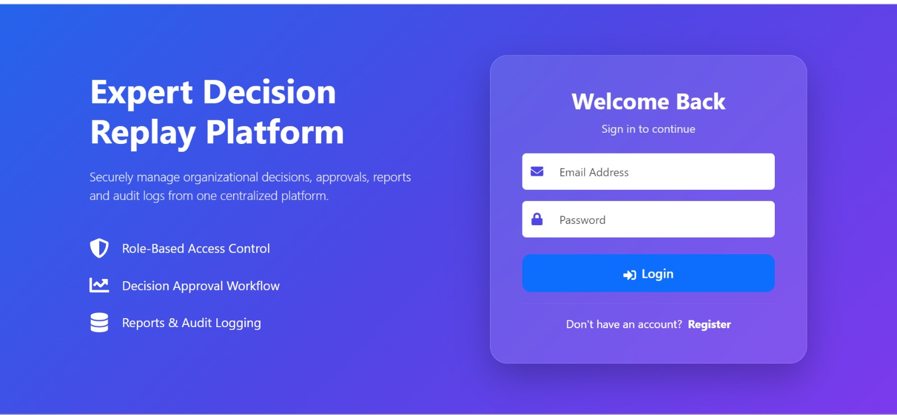
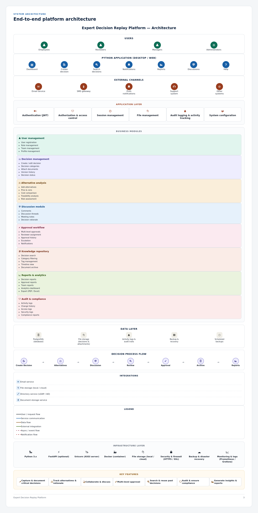

# Expert-Decision-Replay-Platform-Group-2
A centralized platform to record, discuss, approve, and archive organizational decisions — preserving institutional knowledge so teams understand why a decision was made and avoid repeating past mistakes.

##  Overview
The Expert Decision Replay Platform (EDRP) is a decision-management system that captures the full lifecycle of an organizational decision: the problem statement, alternatives considered, evaluation criteria, risks, stakeholders, discussions, approvals, implementation status, and final outcome.
It supports structured decision documentation, multi-level approval workflows, document management, discussion threads,        version history, audit logs, and reporting — built for enterprises, consulting firms, engineering teams, healthcare institutions, government departments, and research organizations.

##  Key Features
- 📝 Capture and document critical decisions with full context
- ⚖️ Track alternatives, pros/cons, cost comparison, and risk assessment
- 💬 Collaborate through comments and discussion threads
- ✅ Multi-level approval workflow with reviewer assignment
- 🔍 Search and reuse past decisions (knowledge repository)
- 📜 Full audit trail and compliance logs
- 📊 Reports, analytics, and export (PDF/Excel)

  ## Architecture
  

## Layers 
- Users — Employees, Reviewers, Managers, Administrators
- Application Layer — Authentication (JWT), Authorization & Access Control, Session Management, File Management, Audit                             Logging
- Business Modules — User Management, Decision Management, Alternative Analysis, Discussion, Approval Workflow, Knowledge                         Repository, Reports & Analytics, Audit & Compliance
- Data Layer — PostgreSQL, File Storage, Activity & Audit Logs, Scheduled Backups
- Infrastructure — Python 3.x, FastAPI, Uvicorn, Docker, HTTPS/SSL, Monitoring
  
## Roles & Permissions
Role and Access

Employee | Create/view decisions, participate in discussions. No approval/reject controls — approval actions are not shown on their screen. |
Manager| Standard registered role with dashboard and reporting access alongside decision creation and discussion. |
Reviewer| Sees the Approval Workflow, but only decisions assigned to them (their own pending/approved items). Can leave a comment and then approve or reject. |
Administrator| Full access — Approval Workflow across all decisions plus Team/User Management (assign roles, manage users). |

### Frontend
Screen , Description,Screenshot 

- Dashboard - Overview with total, approved, pending, rejected decision counts

  

