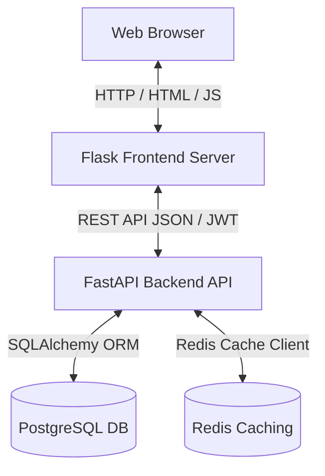
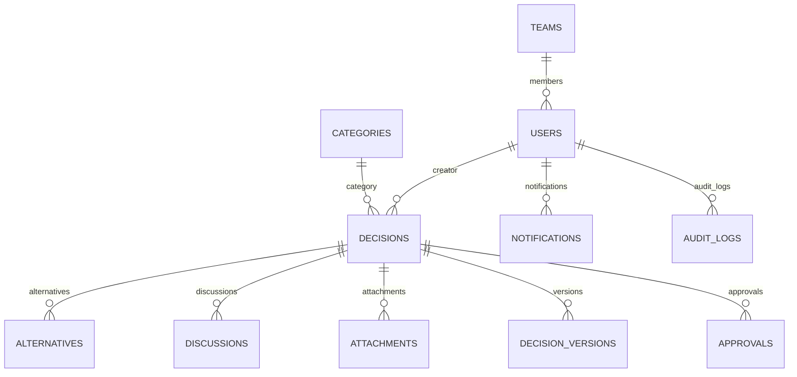

# Developer & Code Architecture Guide

This guide details the codebase architecture, database models, and extendability guidelines of the **Expert Decision Replay Platform**.

---

## 🏗️ Architectural Overview

The application utilizes a decoupled, modern architecture:



*   **Flask Frontend**: Serves templates dynamically, manages user session access tokens inside HTTP-only cookies, and acts as a lightweight proxy forwarder to the FastAPI gateway.
*   **FastAPI Backend**: Enforces role permissions, executes core business operations, records compliance audit logs, and outputs PDF/Excel streams.

---

## 🗄️ Database Schema & Relationships

The database model schemas are designed inside `backend/app/models/`:



### Relationships & Foreign Keys Configuration:
- **Teams & Users**: Circular reference is resolved by using string parameters in `relationship` definitions and setting `use_alter=True`/`post_update=True` in the table migrations.
- **Cascade Deletes**: Foreign key dependencies on Decision (`alternatives`, `discussions`, `attachments`, `versions`, `approvals`) use `cascade="all, delete-orphan"` to guarantee database garbage cleanups upon decision deletions.

---

## 🔒 Security, JWT, & Role Validation

### Authentication Flow:
1.  **Password Hashing**: Done using `bcrypt` via `passlib[bcrypt]` inside [`core/security.py`](file:///Users/radhikaapatil/.gemini/antigravity-ide/scratch/expert_decision_replay_platform/backend/app/core/security.py).
2.  **JWT Tokens**: Generated upon login containing `sub` (user email).
3.  **Role Enforcement**: Decoded on the backend using dependency checking middleware:
    ```python
    class RoleChecker:
        def __init__(self, allowed_roles: List[str]):
            self.allowed_roles = allowed_roles
        def __call__(self, current_user: User = Depends(get_current_active_user)) -> User:
            if current_user.role not in self.allowed_roles:
                raise HTTPException(status_code=403, detail="Forbidden")
            return current_user
    ```

---

## 🛠️ Extending the Application

### Adding a New Seed Category:
Default categories are defined inside [`backend/app/main.py`](file:///Users/radhikaapatil/.gemini/antigravity-ide/scratch/expert_decision_replay_platform/backend/app/main.py)'s startup event sequence. Append your custom category dictionary to `default_categories` to seed it automatically.

### Adding New Event Types to Audit Logging:
Trigger new audit points by executing:
```python
from app.services.decision import AuditLogService
AuditLogService.create(
    db,
    user_id=current_user.id,
    action="CUSTOM_ACTION_NAME",
    entity_name="decisions",
    entity_id=str(decision.id),
    new_values="Custom logs descriptive summary text"
)
```
