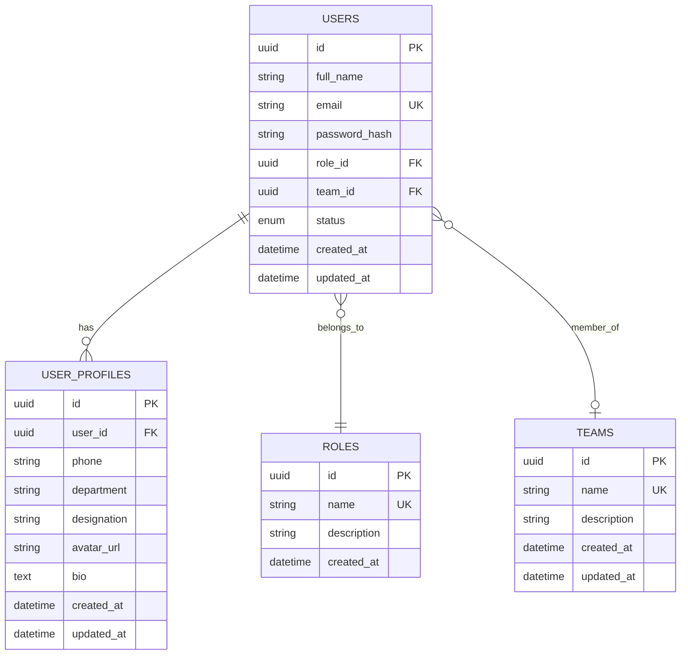
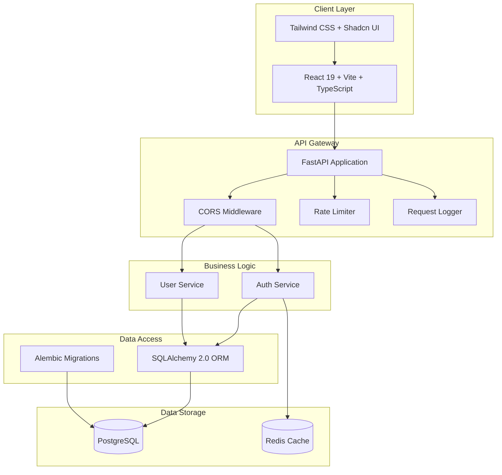
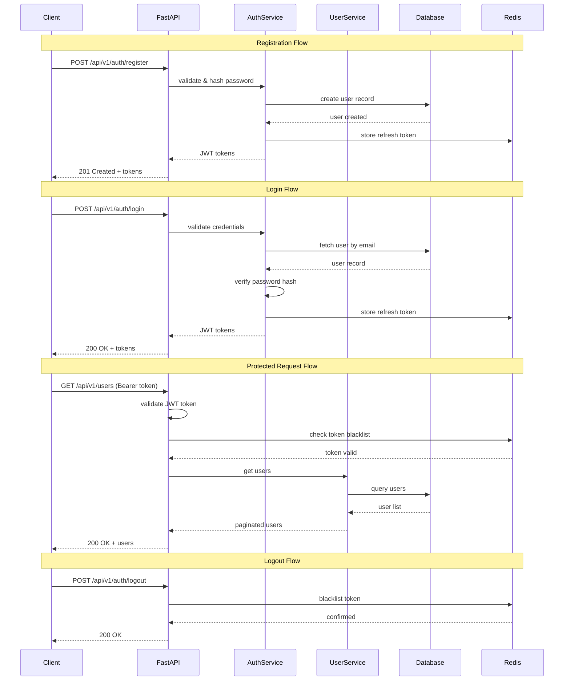

# Expert Decision Replay Platform — Requirements Document

## 1. Project Overview

The Expert Decision Replay Platform is a centralized enterprise platform where organizations record, review, approve, and analyze important decisions. It provides a structured workflow for decision-making with role-based access control, audit trails, and analytics.

---

## 2. Functional Requirements

### FR-1: Authentication & Authorization
- FR-1.1: Users can register with full name, email, and password
- FR-1.2: Users can login with email and password
- FR-1.3: System issues JWT access tokens (30 min) and refresh tokens (7 days)
- FR-1.4: Users can refresh expired access tokens
- FR-1.5: Users can logout (token invalidation)
- FR-1.6: Password reset flow (placeholder for email integration)
- FR-1.7: Role-based access control (Employee, Reviewer, Manager, Administrator)

### FR-2: User Management
- FR-2.1: Administrators can create new users
- FR-2.2: Administrators can view all users with pagination and filtering
- FR-2.3: Users can view their own profile
- FR-2.4: Users can update their own profile information
- FR-2.5: Administrators can assign roles to users
- FR-2.6: Administrators/Managers can assign users to teams
- FR-2.7: Administrators can deactivate (soft-delete) users
- FR-2.8: Users can update their extended profile (phone, department, bio, etc.)

### FR-3: Role Management
- FR-3.1: System maintains four predefined roles
- FR-3.2: Each role has distinct permissions
- FR-3.3: Administrators can view all roles

### FR-4: Team Management
- FR-4.1: Administrators can create teams
- FR-4.2: Administrators can view all teams
- FR-4.3: Administrators can update team information
- FR-4.4: Administrators can delete teams

### FR-5: Dashboard
- FR-5.1: Display total user count and active user count
- FR-5.2: Display user distribution by role
- FR-5.3: Display recent user activity
- FR-5.4: Display team statistics

---

## 3. Non-Functional Requirements

### NFR-1: Performance
- API response time < 200ms for standard operations
- Support 100+ concurrent users
- Database queries optimized with proper indexing

### NFR-2: Security
- Passwords hashed with bcrypt (12 rounds)
- JWT tokens with RS256/HS256 signing
- Rate limiting (100 requests/minute per IP)
- Input sanitization on all endpoints
- CORS configured for allowed origins only
- SQL injection prevention via ORM

### NFR-3: Scalability
- Stateless API design for horizontal scaling
- Database connection pooling
- Modular architecture for feature additions

### NFR-4: Reliability
- Graceful error handling with meaningful messages
- Structured logging for debugging
- Database migration management via Alembic

### NFR-5: Usability
- Responsive UI (mobile, tablet, desktop)
- Dark/Light mode support
- Loading states and skeleton loaders
- Toast notifications for user feedback
- Form validation with real-time feedback

### NFR-6: Maintainability
- Clean Architecture with separation of concerns
- SOLID principles throughout
- Comprehensive API documentation (Swagger/OpenAPI)
- Consistent code style and naming conventions

---

## 4. User Stories

### Employee
- US-1: As an Employee, I want to register an account so I can access the platform
- US-2: As an Employee, I want to login securely so my data is protected
- US-3: As an Employee, I want to view my profile so I can see my information
- US-4: As an Employee, I want to update my profile so I can keep my information current
- US-5: As an Employee, I want to change my password so I can maintain security

### Reviewer
- US-6: As a Reviewer, I want to view team members so I can see who I work with
- US-7: As a Reviewer, I want to view my team's information so I understand my context

### Manager
- US-8: As a Manager, I want to view all users in my team so I can manage my team
- US-9: As a Manager, I want to assign team members so I can organize my team
- US-10: As a Manager, I want to view dashboard statistics so I can monitor activity

### Administrator
- US-11: As an Administrator, I want to create users so I can onboard new employees
- US-12: As an Administrator, I want to assign roles so I can control access
- US-13: As an Administrator, I want to manage teams so I can organize the company
- US-14: As an Administrator, I want to deactivate users so I can offboard employees
- US-15: As an Administrator, I want to view all system statistics on the dashboard

---

## 5. Use Cases

### UC-1: User Registration
- **Actor**: Unregistered User
- **Precondition**: User has a valid email
- **Flow**:
  1. User navigates to registration page
  2. User fills in full name, email, password, confirm password
  3. System validates input (email format, password strength)
  4. System checks email uniqueness
  5. System creates user with hashed password and default "Employee" role
  6. System returns JWT tokens
  7. User is redirected to dashboard
- **Postcondition**: User account created and authenticated

### UC-2: User Login
- **Actor**: Registered User
- **Precondition**: User has valid credentials
- **Flow**:
  1. User navigates to login page
  2. User enters email and password
  3. System validates credentials
  4. System generates JWT access and refresh tokens
  5. User is redirected to dashboard
- **Alternative Flow**: Invalid credentials → error message displayed
- **Postcondition**: User authenticated with valid tokens

### UC-3: User Management (Admin)
- **Actor**: Administrator
- **Precondition**: Admin is authenticated
- **Flow**:
  1. Admin navigates to Users page
  2. Admin views paginated user list with search/filter
  3. Admin can create, edit, assign roles, assign teams, deactivate users
- **Postcondition**: User records updated

### UC-4: Profile Management
- **Actor**: Authenticated User
- **Precondition**: User is logged in
- **Flow**:
  1. User navigates to Profile page
  2. User views current profile information
  3. User edits profile fields (phone, department, bio, etc.)
  4. System validates and saves changes
  5. Success notification displayed
- **Postcondition**: Profile updated

---

## 6. ER Diagram

---

## 7. Architecture Diagram

---

## 8. API Flow

---

## 9. API Endpoints Summary

| Method | Endpoint | Description | Auth Required | Roles |
|--------|----------|-------------|---------------|-------|
| POST | `/api/v1/auth/register` | Register new user | No | — |
| POST | `/api/v1/auth/login` | Login | No | — |
| POST | `/api/v1/auth/refresh` | Refresh access token | Yes | All |
| POST | `/api/v1/auth/logout` | Logout | Yes | All |
| GET | `/api/v1/auth/me` | Get current user | Yes | All |
| POST | `/api/v1/auth/forgot-password` | Forgot password | No | — |
| POST | `/api/v1/users` | Create user | Yes | Admin |
| GET | `/api/v1/users` | List users | Yes | Admin, Manager |
| GET | `/api/v1/users/{id}` | Get user | Yes | All |
| PUT | `/api/v1/users/{id}` | Update user | Yes | Admin, Self |
| DELETE | `/api/v1/users/{id}` | Deactivate user | Yes | Admin |
| PATCH | `/api/v1/users/{id}/role` | Assign role | Yes | Admin |
| PATCH | `/api/v1/users/{id}/team` | Assign team | Yes | Admin, Manager |
| PUT | `/api/v1/users/{id}/profile` | Update profile | Yes | Self |
| GET | `/api/v1/roles` | List roles | Yes | Admin |
| POST | `/api/v1/teams` | Create team | Yes | Admin |
| GET | `/api/v1/teams` | List teams | Yes | All |
| PUT | `/api/v1/teams/{id}` | Update team | Yes | Admin |
| DELETE | `/api/v1/teams/{id}` | Delete team | Yes | Admin |
